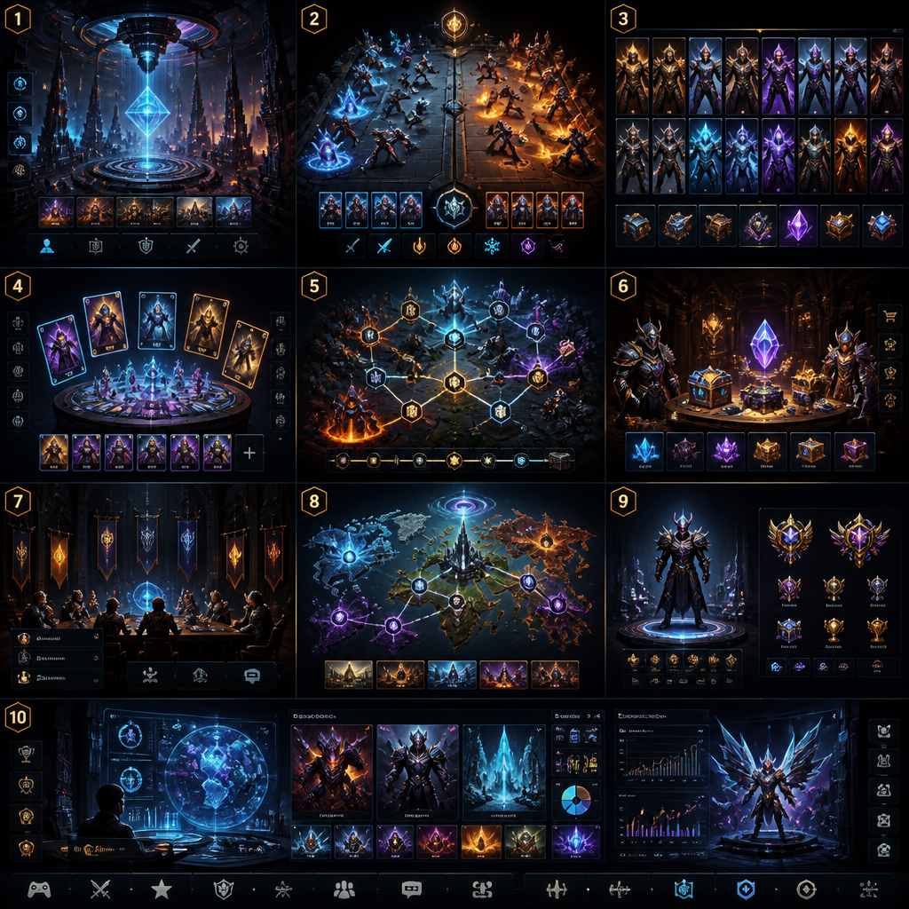

# VEXFORGE — AUTHORITY REPLACEMENT / FORGEFORMATION V6

**Estado:** ACTIVE  
**Autoridad:** documento maestro entregado por el operador  
**Aplicación:** protocolo operativo VEXFORGE en Supabase  
**Fecha de integración:** 2026-09-14

## Declaración vinculante de reemplazo

Este documento reemplaza el motor de combate y la planificación operativa anteriores. ForgeFormation v6.0.0, Battle Run v6, Event Contract v6, Settlement v6, Battlefield Layout v1.0.0 y Visual System v1.0.0 son ahora el sistema activo de VEXFORGE.

Las implementaciones, RPCs, payloads y rutas anteriores se conservan únicamente como historial, auditoría o compatibilidad de migración. No son autoridad de ejecución, no pueden recibir nuevas partidas competitivas y no deben coexistir como un motor paralelo.

La regla operativa es: un solo motor, una sola autoridad de reglas, un solo event log canónico, un solo settlement autoritativo y Android como renderer/input/replay del contrato vivo. Todo trabajo posterior debe seguir la secuencia T0–T10 de esta especificación.

Las políticas operativas no conflictivas del Protocolo V2.1 —seguridad, RLS, transporte, datos oficiales, continuidad, releases y gates de Android— permanecen obligatorias y subordinan cualquier implementación a esta autoridad de gameplay.

## Especificación maestra integrada

VEXFORGE
ForgeFormation v6 — Formal Rules, Battlefield & Visual Master Specification
Battle Run • Event Log • Settlement • Missions • PvP • PvE • Boss • Raid • Clan War • Battlefield • Visual System
Purpose: transformar el diseño conceptual v1.1 en una especificación operativa suficientemente precisa para que Supabase/Replit/Android implementen el mismo juego sin inventar reglas durante la ejecución.
Authority: el Protocolo VEXFORGE V2.1 mantiene la autoridad operativa. Esta especificación define la autoridad de reglas de gameplay. Ninguna implementación puede contradecir el Protocolo, RLS, seguridad, releases o continuidad.
Version target: forge_formation_v6.0.0 / battle_run_v6 / settlement_v6 / battlefield_layout_v1.0.0 / visual_system_v1.0.0. Las versiones t2/t5 anteriores se conservan como históricas y no se reescriben.
Design thesis
FORMATION = BOARDHAND = OPTIONSCOMMAND = ECONOMYRESERVE = FUTURECHAMPION = VICTORY CONDITIONBATTLE RUN = AUTHORITYEVENT LOG = REPLAYSETTLEMENT = ECONOMIC FINALITY
Revision scope v1.1 — Battlefield System and implementation hardening
This revision preserves ForgeFormation v6.0.0 as the gameplay rules target and adds a formal Battlefield System v1.0. The battlefield is a shared presentation/interaction contract with mode-specific visual profiles. It does not create a parallel combat engine, continuous movement system, or client-authoritative state.
The battlefield geometry, slot semantics, event-to-visual mapping, camera policy, mode profiles, touch contract, replay behavior, performance budget, and Replit execution order are now explicit. Tutorial redesign is intentionally out of scope for this implementation block; tutorial work is deferred to the final onboarding phase after the complete game loop is validated.
Importante: los números de esta especificación son el baseline competitivo v6.0.0. No son “verdades universales”; son valores explícitos que deben pasar por el Balance Harness. Cambiar un número en producción crea una nueva rules_version y nunca modifica retrospectivamente partidas ya resueltas.
1. Resultado de la investigación y qué se toma de los referentes
VEXFORGE no debe copiar a ningún TCG. Se toman mecanismos que resuelven problemas concretos: economía limitada, ventaja de cartas, ventanas de respuesta, banca/reserva, formatos, aprendizaje y control del metajuego. Magic publica explícitamente la tensión entre mana, tempo y card advantage; Pokémon utiliza Active/Bench y reglas de retirada/condiciones; Shadowverse combina recurso incremental, mulligan, evolución, formatos, práctica y puzzles; Flesh and Blood formaliza fases de combate y reaction windows; Yu-Gi-Oh! Master Duel conecta tutorial, Solo, deckbuilding, crafting, eventos y juego online; One Piece introduce un Leader y una economía de DON!!; y Digimon demuestra el valor de una Memory Gauge como economía visible. [R1–R7]
Referencia
Mecanismo estudiado
Traducción a VEXFORGE
Magic: The Gathering
mana, priority, stack, tempo/card advantage
Command, reaction layers, card advantage/tempo metrics
Pokémon TCG
Active + Bench, retreat, status, once-per-turn limits
Champion + active formation + Reserve windows
Shadowverse: Worlds Beyond
play points, mulligan, evolve, formats, puzzles
Command ramp, mulligan, mode profiles, mastery/puzzle layer
Flesh and Blood
combat chain, defend/reaction/damage
Attack event → reaction → counter-reaction → damage
Yu-Gi-Oh! Master Duel
chains, huge deckbuilding space, Solo/tutorial/event ecosystem
card legality, archetypes, Solo/missions, replayable competitive engine
One Piece Card Game
Leader, character field, DON!!, life
Champion identity, formation, Command economy, victory pressure
Digimon Card Game
Memory Gauge and formal rule revisions
explicit visible economy + versioned rules discipline
GDC game design research
economy simulation and decision-making
Balance Harness + constraint-driven tuning
Estas fuentes no justifican por sí mismas ningún número de VEXFORGE. Justifican las clases de problemas que conviene resolver. Los números exactos de v6 son decisiones de diseño de VEXFORGE y deben validarse mediante simulación y juego humano.
1.1 Principios que sí deben sobrevivir a cualquier expansión
La formación de tres unidades es la firma de VEXFORGE y permanece en todos los modos 1v1.
Los modos no crean motores alternativos: cambian contexto, objetivos, límites y modificadores sobre el mismo motor.
El cliente envía intención; el servidor valida, simula, registra y liquida.
Toda fuente de aleatoriedad nace del seed del servidor y es reproducible.
Cada amenaza relevante debe tener una respuesta, un coste, una condición o una ventana de timing.
La complejidad debe vivir en la decisión, no en cientos de excepciones invisibles.
La recompensa nunca puede ser una consecuencia de un resultado que el cliente pueda falsificar.
2. Arquitectura canónica del juego
PROTOCOL V2.1  ↓ operational authorityRULE PROFILE forge_formation_v6  ↓BATTLE RUN v6  ↓EVENT RESOLUTION  ↓EVENT LOG / FINAL SNAPSHOT  ↓SETTLEMENT v6  ↓MODE-SPECIFIC PROGRESSION / RANK / BOSS / RAID / QUEST
2.1 One engine, many modes
Modo
Núcleo
Qué cambia
Qué nunca cambia
RANKED_PVP
ForgeFormation v6
MMR, season, timer, reward profile, abandonment
stats, phases, Command, formation, targeting, RNG, event order
TRAINING
ForgeFormation v6
opponent AI, no competitive settlement
combat resolution
MISSION
ForgeFormation v6
enemy AI, energy, objectives, PvE reward profile
combat rules
ELITE_TRIAL
ForgeFormation v6
stronger encounter package, objectives
combat rules
WORLD_BOSS
ForgeFormation v6
boss profile, shared HP application, phase package
combat rules
RAID
ForgeFormation v6
group contribution aggregation, stages
combat rules
CLAN_WAR
ForgeFormation v6
series/orchestration, clan score, match schedule
each duel remains a normal Battle Run
EVENT
ForgeFormation v6
event ruleset modifier package, format restrictions
core invariants and authority
2.2 Rule modifier stack
L0 HARD INVARIANTSL1 BASE RULESET forge_formation_v6L2 MODE PROFILEL3 ENCOUNTER / EVENT MODIFIERSL4 CARD / KEYWORD EFFECTSL5 DETERMINISTIC RNG RESULTS
Lower layers may not violate higher-layer invariants. An event modifier can change max rounds or reward objectives, but cannot permit negative HP, duplicate rewards, invalid targeting, client-authored outcomes, or destruction of the Champion protection rule unless the modifier explicitly and versionedly changes the legal target rule.
2.3 Three-layer truth model
Layer
Authority
Examples
Static rules
rules_version
formulas, enums, legal phases, invariant definitions
Battle state
server transaction
HP, Command, hand, active slots, statuses, round, timers
Player intent
client request
card id, doctrine, focus, reaction choice, reserve selection
3. Standard deck, formation and zones
3.1 Standard deck v6
Component
Count
Visibility
Purpose
Champion
1
public
identity + primary victory condition
Formation Units
7
active public / reserve hidden until reveal
Champion + 2 active + 5 reserve
Tactical Cards
22
hand hidden / discard public
resource-driven actions, answers, utility
Total
30
—
Standard deck size
La estructura objetivo del v6 es 1 Champion + 7 Formation Units + 22 Tactical Cards. Esta es la regla del formato Standard futuro. Durante la migración, el sistema podrá ejecutar un profile LEGACY_COMPATIBILITY que traduzca decks existentes para pruebas; ese profile no puede recibir rango competitivo ni ser usado para validar el Standard final.
3.2 Copy limit and faction legality
MAX_COPIES_PER_CARD = 2CHAMPION_COPIES = 1DECK_FACTIONS = Champion faction + at most 1 secondary factionNeutral / Universal cards: allowed if the card record marks them as universal
La restricción de dos facciones evita que la identidad de Guerrero/Mago/Paladín/Pícaro se convierta en una lista global de “mejores cartas”. El Champion define la facción primaria. Las cartas fuera de las dos facciones legales son rechazadas por deck validation.
3.3 Battle setup
1. Validate 30-card deck.2. Validate Champion.3. Player selects Champion + 7 unit formation package before match.4. First 8 unit identities are snapshotted into Formation.5. Tactical deck = 22 tactical cards.6. Shuffle tactical deck with battle seed.7. Active slots = Champion + Vanguard + Sentinel.8. Reserve = 5 units, hidden from opponent until Reserve Reveal.9. Draw 5 Tactical cards.10. Perform one Mulligan.11. Set Command = 1.12. Round = 1.
3.4 Public vs hidden information
Información
Propietario
Rival
Champion identity
visible
visible
Active V/S identities
visible
visible
Reserve identities
visible to owner
hidden until reveal
Reserve count
visible
visible
Hand
hidden
hidden
Command
visible
visible
HP/status/Doctrine/Focus after commit
visible as defined by event timing
visible as defined by event timing
Event log
match-visible relevant events
match-visible relevant events
3.5 Hand
INITIAL_HAND = 5HAND_LIMIT = 9DRAW = 1 at Round StartIf a draw would exceed 9: drawn card is placed in DISCARD instead and DRAW_OVERFLOW is logged.
4. Formation v6
4.1 Active formation
CHAMPION      = victory unitVANGUARD       = front supportSENTINEL       = secondary supportRESERVE[1..5]  = future support units
Exactly one Champion exists. At most three active units exist. Reserve units never attack, never defend directly and never count as active targets until deployed. A mode may use an encounter modifier for boss-specific rules, but it cannot create a fourth ordinary active slot without a distinct versioned ruleset.
4.2 Champion protection
protected := (Vanguard.alive OR Sentinel.alive)exposed := NOT protected
A basic attack may not target a protected Champion. Effects with the BREACH flag may target a protected Champion only if the card contract explicitly grants BREACH. Champion-targeted effects must declare whether they respect or bypass protection.
4.3 Pure Formation bonus
If all 3 active units share the Champion faction:  Active HP max += 8%  Active ATK += 8%  Active DEF += 8%  Apply rounding after all additive modifiers.
El 8% es un baseline deliberadamente menor al 15% legacy para que la pure faction identity sea relevante sin convertir la mezcla de facciones en una opción automáticamente inferior. El valor debe someterse al Matchup Matrix.
4.4 Champion reserve pressure
At Battle Start only:  Champion Max HP += 2% per reserve unit included in the 5-slot Reserve  Cap = +10%No ATK/DEF bonus from Reserve Count.
Esto reemplaza el antiguo +5 HP/+1.2 ATK/+0.8 DEF por reserva, que escala de manera difícil de comparar entre distintos rangos de stats. El nuevo bono mantiene la idea de “la Reserva sostiene al Campeón” sin esconder gran parte del balance dentro de una fórmula secundaria.
5. Derived combat statistics
Las cuatro stats de carta siguen siendo Power, Affinity, Prestige y Charge. El motor v6 las transforma en stats de combate mediante fórmulas deterministas. Las fórmulas pueden versionarse, pero no pueden cambiar dentro de una partida.
MAX_INT_SAFE = database-supported integer rangeHP_max     = 4 × Power + AffinityATK_base   = Power + floor(Affinity / 4)DEF_base   = 2 × Prestige + floor(Affinity / 8)SPD_base   = 4 × Charge + floor(Affinity / 10)
Stat
Función
No determina por sí sola
Power
base ofensiva y escala de HP
target, victory
Affinity
identity + HP/ATK/DEF scaling
initiative
Prestige
defense scaling
damage dealt
Charge
initiative scaling / card identity
damage
HP
survival
target priority
ATK
offensive pressure
automatic victory
DEF
mitigation
immunity
SPD
global activation priority
damage / accuracy
5.1 Modifier order
1. Base derived stats2. Formation modifiers (Pure Formation, Champion reserve pressure)3. Temporary status modifiers4. Doctrine modifier5. Card effect modifier6. Clamp / round
Todos los porcentajes se calculan en enteros racionales. No se usan floats en settlement-critical calculations.
5.2 Rounding law
floor(x) for offensive / stat additions unless explicitly defined otherwiseceil(x) for mitigation damage formularound-half-away-from-zero is forbiddenNo floating point in authoritative state
6. Command — economía táctica
INITIAL_COMMAND = 1COMMAND_MAX = 6COMMAND_GAIN_PER_ROUND = 1UNSPENT_COMMAND = retained, subject to COMMAND_MAXNo separate wallet/bank resource
Se elimina el concepto ambiguo de “0–2 banked Command” como una segunda reserva. V6 usa una única piscina visible de 0–6. Esto simplifica la interfaz, la simulación y el análisis de tempo.
6.1 Command costs
Acción
Coste
Límite
Main Tactical
0–4
máximo 1 por jugador por round
Reaction
0–3
máximo 1 por response layer
Doctrine
0
1 por round
Focus
0
1 por round
Basic Attack
0
automático, 1 vez por unidad viva elegible/round
Reserve Selection
0
1 choice per reserve event
6.2 Command invariants
Command nunca puede ser negativo.
El coste se descuenta solo cuando la acción es aceptada por el servidor.
Una solicitud rechazada no consume Command.
Un retry con la misma idempotency key no vuelve a consumir Command.
La reserva de Command no se puede comprar, transferir ni generar por reward.
En Ranked ambos lados siguen exactamente el mismo perfil de economía.
6.3 Resource tension
El diseño debe producir decisiones como: gastar 4 Command para una conversión de tempo ahora o guardar 3 para responder; usar una táctica que genera card advantage pero deja el Champion expuesto; gastar una reacción ahora o aceptar daño para conservar Command para el siguiente intercambio. Esto operacionaliza el principio de tempo/card advantage documentado por Magic. [R8]
7. Mulligan y ciclo de cartas
Initial hand = 5Mulligan = choose any subset 0..5 onceReplacement cards = draw same countMulliganed cards are shuffled into deck before replacement drawNo second mulligan
7.1 Objective
El mulligan no busca encontrar una carta obligatoria. El Balance Harness medirá bad-start rate, matchup consistency, interaction availability y win-rate por deck para evitar que Standard se convierta en “mulligan for X or lose”.
7.2 Card zones
DRAW_DECKHANDDISCARDFORMATION_ACTIVERESERVEEXILESECRETS (server-only metadata; never game state)
Toda transición de zona genera un event log si afecta el gameplay. Un evento nunca puede mover una carta dos veces ni duplicar una referencia de carta en zonas incompatibles.
7.3 Deck-out / Fatigue
If draw requested and DRAW_DECK is empty:  fatigue += 1  true_damage_to_Champion = 2 + fatigue  if Champion reaches 0: player losesFatigue is not preventable by Veil, DEF, Guard, or Breach
Fatigue es un seguro contra loops infinitos y una estrategia legítima de attrition. Sigue terminando por muerte del Champion, por lo que no crea una segunda condición de victoria.
8. Ronda canónica y ventanas de decisión
ROUND_START  ↓PLANNING  ↓COMMIT  ↓REACTION WINDOWS  ↓GLOBAL INITIATIVE RESOLUTION  ↓STATE-BASED CLEANUP  ↓RESERVE WINDOWS  ↓ROUND_END  ↓next round
8.1 Round Start
Incrementar Command en +1 hasta 6.
Draw 1 card o aplicar Fatigue.
Resolver efectos de inicio de ronda.
Actualizar duraciones de estados.
Emitir ROUND_START.
8.2 Planning
Los dos jugadores disponen simultáneamente de una ventana de planificación. Esto elimina el requisito de “jugador A siempre comienza con la prioridad del turno”. Cada jugador presenta una intención. Si un jugador no confirma antes del deadline, el servidor genera un AUTO_PASS. En Ranked, dos timeouts consecutivos producen ABANDONMENT según el profile competitivo; en PvE el profile puede auto-resolver.
8.3 Commit schema
{  round,  doctrine,  focus_target,  main_tactic: {card_id, target_ids[]}|null,  reserve_preference: optional,  idempotency_key}
Commit no implica que el efecto esté aceptado. El servidor vuelve a validar legalidad, coste, timing, ownership y target durante resolución.
8.4 Action limits
1 Doctrine / round1 Focus / round1 Main Tactical / roundReaction cards only inside legal Reaction windowsBasic attacks are resolved by the engine, not manually spammed by the client
9. Doctrine v6
Doctrine
Exact effect
Strategic purpose
ASSAULT
First allied basic attack this round gains +10% final damage.
trade tempo for aggression
GUARD
First non-Champion allied unit that would receive lethal damage this round survives at 1 HP instead.
stabilize formation
CONTROL
First allied Reaction this round costs 1 less Command (minimum 0).
reserve counter-resource
RESERVE
When a Reserve Window opens this round, reveal 4 candidates instead of 3.
improve future planning
Doctrine is a stance. It is selected once per round and does not stack. If the benefit never triggers, it simply expires. Doctrine does not grant permanent stats.
9.1 Doctrine conflict
If a card explicitly says “cannot be modified by Doctrine”, Doctrine does not apply. Otherwise Doctrine is evaluated after base stats and before card-specific final modifiers. Doctrine cannot revive a Champion or invalidate a hard rule.
10. Focus y targeting
Target legality precedence:1. Card-specific mandatory target2. Hard protection / immunity rules3. Guard priority4. Valid Focus target5. Lowest HP percentage6. Lowest current HP7. Slot order: Vanguard > Sentinel > Champion
10.1 Focus
Focus es una intención táctica gratuita. Si el target Focus es legal, los ataques básicos intentarán ese target. Focus no puede ignorar Guard ni Champion protection. Las cartas Breach/IgnoreGuard pueden declarar excepciones explícitas.
10.2 Guard
If one or more legal enemy units have Guard:  basic attack target set = Guarded legal units  among them apply Focus if compatible  otherwise lowest HP%
Esto sustituye la fórmula opaca “primer Guard en el array”. La prioridad es ahora visible y auditable.
10.3 Champion protection
Basic Attack → protected Champion = illegalBreach Attack → protected Champion = legal if card contract says BreachDirect Tactical → protected Champion = illegal unless card contract says BypassProtection
11. Global initiative
V6 abandona el patrón “lado A ataca, luego lado B”. Cada unidad activa viva obtiene una activación básica por ronda. El engine ordena esas activaciones globalmente. Con ello SPD tiene una función real sin decidir automáticamente quién gana.
initiative_score = SPD_finalTie-break key = SHA256(seed || round || event_type || unit_id)Sort descending by initiative_score; ties by tie-break key ascending
11.1 Activation rules
Cada unidad activa viva al iniciar Resolution recibe exactamente un activation token.
La unidad consume su token cuando ejecuta su basic attack o cuando un estado le impide actuar.
Una unidad muerta antes de su activation se elimina de la queue.
Una unidad recién desplegada normalmente no obtiene activación en esa ronda.
Una unidad con Rush puede obtener una activation adicional inmediata, una sola vez, al final del evento que produjo su entrada.
11.2 Surge
Surge → +20 initiative_score for the current round
Surge ya no altera directamente daño. Solo modifica prioridad; esto refuerza la identidad de Charge/Speed sin duplicar poder ofensivo.
12. Basic Attack y daño
1. Determine attacker alive/eligible.2. Resolve target legality.3. Determine effective ATK.4. Apply critical if rolled.5. Apply Breach/other attack modifiers.6. Mitigate with DEF.7. Apply Veil if present.8. Apply final damage.9. Apply Drain.10. Emit damage events.11. Resolve lethal state immediately.12. Open Reserve Window if required.
12.1 Critical
CRIT_CHANCE = 15% baselineCRIT_MULTIPLIER = 1.50If RNG event value < 0.15:  effective_ATK = floor(ATK × 1.50)else:  effective_ATK = ATK
El crítico ya no utiliza la fórmula pseudoaleatoria dependiente de round/power del RPC legacy. El seed del Battle Run genera una secuencia reproducible e independiente del cliente.
12.2 Mitigation
mitigated = ceil(effective_ATK × 100 / (100 + DEF))final_damage = max(1, mitigated)
DEF reduce de forma no lineal y evita que una unidad defensiva convierta toda amenaza en daño cero sin necesitar una lista enorme de excepciones.
12.3 Damage example
ATK = 40DEF = 20normal = ceil(40×100/120) = 34critical ATK = floor(40×1.5) = 60critical damage = ceil(60×100/120) = 50
13. Keyword Contract v6
Keyword
Formal definition
Default duration / stacking
Guard
Makes unit highest-priority target among legal basic-attack targets.
static keyword
Veil
The next incoming direct damage instance becomes 0; Veil is then removed.
1 charge
Drain
Heals attacker for floor(25% of final damage dealt), capped at Max HP.
static keyword
Surge
Adds +20 initiative score for current round.
1 round
Breach
Attack may legally target a protected Champion.
per attack flag
Rush
Newly deployed unit may perform one immediate basic attack after entry, with -20% final damage.
1 entry
Silence
Unit cannot trigger activated or passive card abilities; basic attack and damage still function.
1 full round
Poison
At Round End, deal 2 + floor(2% Max HP) true damage per Poison stack; max 3 stacks.
stacks 1–3
13.1 Status object
{  status_id,  source_event_id,  source_card_id,  target_unit_id,  start_round,  end_round,  stacks,  magnitude,  flags}
13.2 Silence priority
Silence disables card abilities only. It does not erase basic stats, does not remove formation role, does not remove Champion protection and does not retroactively cancel an effect that has already resolved.
13.3 Poison order
At ROUND_END, resolve Poison simultaneously across all targets using the state at the beginning of the Poison step. Then run lethal checks. This avoids order-dependent poison kills.
14. Reaction system — profundidad sin stack infinito
La ventana de reacción toma la idea estructural de juegos como Flesh and Blood y Magic, pero se comprime para móvil: origen → reacción defensiva → contra-reacción del origen. No existe un stack abierto de profundidad arbitraria.
EVENT E0 = attack declaration or tactical commitmentLayer 0 = originating actionLayer 1 = defending/targeted side may play 1 ReactionLayer 2 = originating side may play 1 Counter-ReactionResolve layers L2 → L1 → L0Then run Resolution + state checks
14.1 Reaction eligibility
Condition
Allowed
Reaction card matches trigger
yes
Player owns card and card is in legal zone
yes
Command >= cost
yes
Reaction after Layer 2
no
Reaction targeting illegal object
no
Reaction submitted after deadline
no; auto-pass
14.2 Reaction loop prevention
Maximum depth = 2 response layers.
No effect may create another reaction window against a reaction in the same event beyond Layer 2.
A “counter-reaction” card cannot itself open a new counter-reaction.
Global event chain length is capped at 4 external events per action before forced resolution; exceeding the cap is a server error that aborts the run safely before settlement.
14.3 Why not unlimited stack
Magic demonstrates the power of priority and stack interactions, while Flesh and Blood formalizes combat reactions. VEXFORGE borrows the strategic lesson but intentionally limits depth to preserve mobile readability and deterministic resolution time. [R1, R5]
15. Reserve system — signature mechanic
La Reserva debe producir skill expression. No se selecciona automáticamente por ATK o DEF.
When Vanguard or Sentinel dies:1. Freeze further resolution.2. Recalculate exposed/protected.3. Reveal candidates from remaining Reserve.4. Candidate count = 3 normally, 4 with RESERVE Doctrine.5. Player selects exactly 1 candidate.6. If no selection before deadline, default = first candidate by stable server order.7. Candidate enters matching slot.8. Non-selected candidates return hidden to Reserve.9. Emit RESERVE_ACTIVATED.
15.1 Candidate generation
Los candidatos se seleccionan usando el seed del Battle Run, no el cliente. Se calcula un hash independiente para cada reserve_unit_id y se escogen los N menores entre las unidades elegibles. Esto evita que una consulta manipulada pueda pedir “la mejor de mis cartas”.
15.2 Entry state
On Reserve activation:  unit.alive = true  unit.slot = dead slot  unit.entered_round = current round  unit.has_acted_this_round = false  unit.Guard = inherited only if card contract says so  if Rush: immediate activation after current event
15.3 Double death
Si una misma resolución mata Vanguard y Sentinel, los reemplazos se procesan en orden canónico VANGUARD → SENTINEL. El Champion se verifica primero y, si ha muerto, la partida termina sin abrir ninguna Reserve Window.
15.4 Reserve visibility
Solo los candidatos revelados son públicos. Las cartas no seleccionadas permanecen ocultas. El evento log contiene exactamente qué candidatos fueron revelados y cuál fue elegido; no revela cartas que jamás fueron descubiertas en la partida.
16. Champion exposure y Breach
protected = V alive OR S aliveexposed = V dead AND S deadIf exposed:  basic attacks may target Champion  Focus may target Champion  Guard on remaining non-Champion is impossible because none exists
16.1 Breach
Breach attack against protected Champion:  target becomes legal  damage multiplier = 0.75  Guard does not redirect the attack  Veil may still prevent damage
Breach tiene coste implícito: concede daño reducido para convertir la protección en una ventana atacable. Las cartas pueden aumentar/reducir ese multiplicador solo mediante un contrato versionado.
16.2 No hidden bypass
No keyword, passive or boss effect puede atacar al Champion protegido por sorpresa. Si una carta puede hacerlo, su Card Design Contract debe declarar BypassProtection=true y ese permiso debe aparecer en tooltips y event log.
17. State-based actions y resolución de muertes
After every atomic effect:1. Evaluate HP <= 0.2. Mark units dead.3. If Champion dead on either side → resolve victory immediately.4. Else process support deaths in VANGUARD → SENTINEL order.5. Open Reserve windows.6. Re-evaluate Champion protection.7. Continue event queue.
17.1 Simultaneous Champion death
Si una resolución produce la muerte de ambos Champions en el mismo atomic effect, el resultado es DRAW. No existe “challenger wins on >=”. Esto elimina el sesgo heredado del RPC actual.
17.2 Healing after lethal
Una unidad marcada como dead no puede ser curada por eventos posteriores de la misma cadena. Los eventos deben fallar de forma segura si su target ya no es eligible.
17.3 Negative HP
HP_state = max(0, raw_hp)
El event log puede conservar raw damage y overkill, pero canonical HP nunca es negativo.
18. Sudden Forge, draw y match length
STANDARD_RANKED_MAX_ROUNDS = 12MISSION_DEFAULT_MAX_ROUNDS = 10ELITE_TRIAL_MAX_ROUNDS = 14BOSS_MAX_ROUNDS = 18RAID_MAX_ROUNDS = 20
Estos perfiles son objetivos iniciales. El Balance Harness debe medir p50/p75/p90/p95. No se declara que una duración es correcta simplemente porque el número esté escrito en el documento.
18.1 Sudden Forge
At round > profile.max_rounds:  forge_pressure = round - max_rounds  final direct damage multiplier = 1 + 0.10 × forge_pressure  healing multiplier = max(0.25, 1 - 0.25 × forge_pressure)  sudden_round_limit = 3If Champion death occurs → normal winnerIf both Champions alive after 3 sudden rounds → DRAW
18.2 Draw
DRAW es un resultado real y auditable. Ranked define posteriormente cómo afecta MMR; el combat engine no “regala” victoria a un lado para evitar empates.
19. Deterministic RNG
El engine necesita aleatoriedad reproducible. No se usa Math.random, funciones locales ni RNG del cliente.
battle_seed = 32-byte cryptographic random value created server-siderandom_u32(context) = first 4 bytes of SHA-256(battle_seed || context)unit_interval = random_u32 / 2^32context examples:  ROUND:round:CRIT:unit_id  ROUND:round:RESERVE:slot  ROUND:round:TIE:unit_id
19.1 RNG rules
Cada random event tiene un context string estable.
No se permite consumir RNG implícito; todo RNG debe tener event_type.
El evento registra rng_context y rng_output_summary, no el seed secreto si el producto aún no ha decidido hacerlo público.
El replay usa el mismo seed + mismos commands + misma versión para regenerar el resultado.
Una modificación en RNG algorithm exige nueva rules_version.
20. Battle Run v6 contract
BattleRun {  battle_run_id: UUID,  player_a_id: UUID,  player_b_id: UUID|null,  mode: enum,  rules_version: text,  card_rules_version: text,  reward_version: text,  mission_version: text|null,  battlefield_profile_id: text,  battlefield_layout_version: text,  seed: bytea,  initial_snapshot: jsonb,  formation_snapshot_a: jsonb,  formation_snapshot_b: jsonb,  command_log: jsonb,  event_log: jsonb,  final_snapshot: jsonb|null,  outcome: enum|null,  contribution: jsonb|null,  settlement_id: UUID|null,  status: enum,  started_at,  resolved_at,  settled_at}
20.1 Status enum
CREATEDREADYMULLIGANACTIVERESERVE_PENDINGRESOLVINGRESOLVEDSETTLEMENT_PENDINGSETTLEDABANDONEDEXPIREDFAILED
20.2 Outcome enum
WIN_AWIN_BDRAWABANDONED_AABANDONED_BTIMEOUT_ATIMEOUT_BERROR_UNSETTLED
20.3 Client authority boundary
ALLOWED FROM CLIENT:  intent, card_id, doctrine, focus, reaction choice, reserve choice, reference_idFORBIDDEN AS AUTHORITY:  p_won, final_hp, damage, final_snapshot, contribution, xp, reward, quest_progress
21. Event Contract v6
Event {  event_id: UUID,  battle_run_id: UUID,  seq: bigint,  round: int,  phase: enum,  event_type: enum,  side: A|B|SYSTEM,  source_unit_id: UUID|null,  source_card_id: UUID|null,  target_unit_id: UUID|null,  payload: jsonb,  rng_context: text|null,  rules_version: text}
21.1 Canonical event types
BATTLE_CREATEDBATTLEFIELD_PROFILE_SELECTEDMULLIGAN_STARTEDMULLIGAN_RESOLVEDROUND_STARTCOMMAND_GAINEDCARD_DRAWNDOCTRINE_COMMITTEDFOCUS_COMMITTEDTACTIC_COMMITTEDREACTION_COMMITTEDREACTION_RESOLVEDATTACK_DECLAREDTARGET_LOCKEDCRIT_ROLLEDDAMAGE_CALCULATEDDAMAGE_APPLIEDHEAL_APPLIEDSTATUS_APPLIEDSTATUS_REMOVEDUNIT_KILLEDRESERVE_REVEALEDRESERVE_SELECTEDRESERVE_ACTIVATEDCHAMPION_EXPOSEDCHAMPION_DEFEATEDFATIGUE_TRIGGEREDSUDDEN_FORGE_STARTEDROUND_ENDMATCH_ENDSETTLEMENT_STARTEDPHASE_CHANGEDSETTLEMENT_COMPLETED
21.2 Event immutability
Event log es append-only. Correcciones no editan eventos antiguos: se agrega un correction/reconciliation event con referencia al event_id problemático. El replay siempre usa la secuencia canonical marcada como valid.
22. Card Design Contract v6
CardDefinition {  card_id  card_type  faction  rarity  cost  timing  role_tags[]  target_rules  effect_definition  keywords[]  duration_rules  counterplay_rules  risk  archetype_tags[]  formation_compatibility  reserve_compatibility  champion_compatibility  max_copies  rules_version}
22.1 Roles
THREATRESPONSEPROTECTIONTEMPOCARD_ADVANTAGEDISRUPTIONCONVERSIONFINISHER
22.2 Production gate
Una carta no pasa al pool competitivo sin definición explícita de: qué hace, cuándo lo hace, qué targets puede usar, qué la detiene, cuánto cuesta, qué riesgo genera, con qué arquetipos coopera y contra qué arquetipos es débil. Esto traduce la teoría de card advantage/tempo en una disciplina de diseño, no en una etiqueta de marketing. [R8]
23. Mission Engine v6
COMBAT MISSION:OFFERED → STARTED → BATTLE_PENDING → BATTLE_RESOLVED → WON/LOST → SETTLEMENT_PENDING → SETTLEDINSTANT MISSION:OFFERED → STARTED → SETTLEMENT_PENDING → SETTLED
23.1 Mission families
Familia
Función
CHRONICLE
narrativa + teaching
BOUNTY
PvE repetible con objetivos
MASTERY
dominio de mecánicas
DAILY
actividad diaria basada en eventos
WEEKLY
objetivos de sesión/progresión
ELITE
dificultad + restricciones
TRIAL
puzzle estratégico + combate
DUNGEON
cadena de encuentros
EVENT
reglas temporales versionadas
23.2 Mission Master Record
mission_idversionfamilyregionnarrative_definitionenemy_definitionformation_definitionrules_versionobjectivesecondary_objectives[]constraints[]modifiers[]energy_costcooldownxp_rewardreward_definitionquest_tags[]difficultyretry_policyexpiration
23.3 Mission philosophy
Una misión Tier 1 debe enseñar, probar, desafiar, recompensar o desbloquear una capacidad del jugador. El motor de combate no se falsifica para “hacer parecer” que una tarea de energía fue una batalla. Las misiones combativas deben recorrer el Battle Run; las misiones instantáneas deben declararse como instantáneas.
24. PvE encounter architecture
Encounter family
Primary pressure
Recommended design
PRESSURE
tempo
fast enemy initiative + limited answers
FORTIFICATION
protection
Guard / shield / slow break
SWARM
card/board overload
many low-power effects
EXECUTION
finish
punish low Champion HP / exposed state
ATTRITION
resource
deck pressure + Poison + Command tension
PUZZLE
decision
fixed initial snapshot + exact objective
DECEPTION
information
reserve reveal and hidden plan
PHASED BOSS
adaptation
ruleset modifier changes at HP thresholds
La dificultad debe crecer primero mediante comportamiento, objetivos, ventanas y restricciones; solo después mediante stat inflation. El motor sigue siendo el mismo.
24.1 Boss phases
BossPhase {  phase_id,  min_hp_pct,  max_hp_pct,  modifier_set[],  AI_policy_id,  reward_context_id}
Cambiar de fase produce PHASE_CHANGED en el event log. Un boss no obtiene un “motor secreto”; obtiene una configuración versionada de reglas que el mismo resolver conoce.
25. World Boss
START BATTLE RUN→ RESOLVE WITH ForgeFormation v6→ DERIVE VERIFIED DAMAGE→ ATOMICALLY APPLY TO SHARED BOSS HP→ CHECK PHASE→ CALCULATE PERSONAL CONTRIBUTION→ SETTLE REWARD
25.1 Contribution
verified_damage = sum(event DAMAGE_APPLIED against Boss target)final_verified_damage = min(verified_damage, remaining_boss_hp)no client-submitted damage accepted as authority
25.2 Economic protections
battle_run_id unique for contribution settlement
boss encounter locked during atomic HP update
same battle_run_id cannot apply contribution twice
reward calculated from canonical verified contribution
retries return the previous canonical settlement
26. Raid
JOIN RAID→ START RAID BATTLE RUN→ RESOLVE→ VALIDATED CONTRIBUTION→ RAID PROGRESS→ PERSONAL SCORE→ GROUP STATE→ SETTLEMENT
26.1 Legacy shutdown
El contrato legacy de contribución directa de dos parámetros no debe ser usado en producción. Debe quedar en una migration matrix con fecha de sustitución, consumer inventory y pruebas de regresión. Ninguna Raid Android puede incrementar contribution sin una Battle Run completada y validada.
26.2 Raid orchestration
Una Raid puede contener N Battle Runs independientes. El raid controller agrega sus resultados; no resuelve combate. Esto permite fases, rooms, scoreboards y rewards sin duplicar ForgeFormation.
27. Clan War
La Guerra de Clanes tampoco necesita un tercer motor. Debe ser una capa de competición que orquesta Battle Runs normales.
CLAN WAR  ↓MATCH SCHEDULE  ↓DUEL PAIRING  ↓Battle Run v6 per duel  ↓Clan Score Aggregator  ↓War Settlement
27.1 Initial clan format
Recommended launch structure:  5 players per clan active roster  each participant plays 1 Battle Run  clan score = weighted match result + objective bonus  no direct stat bonuses for clan membership  same Standard legality rules as Ranked unless event profile says otherwise
Los pesos exactos de score deben pertenecer al Clan War Profile, no al combat engine. Así el mismo combate puede alimentar Ranked, amistosos o Clan War sin forks.
28. PvP ranked
Battle Run v6 + MMR + Season + Abandonment + Timeout + Replay + Leaderboard Audit
28.1 Competitive integrity
No Command comprable.
No RNG manipulable por cliente.
No card ownership bypass.
No outcome parameter accepted.
No reward duplication.
No legacy raid contribution path in ranked ecosystem.
No reward settlement before canonical result.
28.2 MMR
El Elo/K-factor existente puede conservarse como starting implementation del Ranked layer, pero no forma parte de ForgeFormation. El combat engine devuelve WIN/LOSS/DRAW; el ranking service convierte ese outcome en rating change. Esto evita acoplar balance de combate con matemáticas de ladder.
28.3 Reconnect and abandon
Situación
Combat result
Settlement policy
Network retry
unchanged
same idempotency result
Refresh while ACTIVE
unchanged
resume canonical run
Timeout first occurrence
AUTO_PASS
continues
Repeated timeout
TIMEOUT/ABANDON
profile-specific penalty
Intentional surrender
LOSS / ABANDON
recorded
Server failure before resolution
UNSETTLED
safe retry, no reward
29. Training, Solo y Puzzle
Training no debe tener un motor local distinto. `client_ai_v1` pasa a ser un wrapper de AI y UI sobre ForgeFormation v6. Puede seleccionar intenciones automáticamente, pero el resolver sigue siendo el mismo.
29.1 AI contract
AI chooses:  doctrine  focus  tactic  reaction  reserve selectionAI does not calculate outcome separately from ForgeFormation v6.
29.2 Puzzle
Puzzle snapshot:  fixed seed  fixed formation  fixed hand  fixed Command  objective  solution validator
Los puzzles son una herramienta estratégica: “save the Champion”, “find the Breach”, “win with 1 Command”, “best Reserve”, “survive attrition”. Shadowverse y Yu-Gi-Oh! muestran el valor de mezclar tutorial, solo y puzzles dentro del mismo universo de reglas. [R3, R4]
30. Settlement v6
LOCK RUN→ VALIDATE OWNER→ VALIDATE STATUS→ VALIDATE RULES VERSION→ VALIDATE FINAL RESULT→ DERIVE REWARD→ APPLY WALLET LEDGER→ APPLY XP→ RECALCULATE LEVEL→ UPDATE QUEST PROGRESS FROM EVENTS→ WRITE COMPLETION LOG→ MARK SETTLED→ RETURN CANONICAL RESULT
30.1 Settlement idempotency
UNIQUE(settlement_reference_id)UNIQUE(battle_run_id) for terminal settlementUNIQUE(pvp_matches.reference_id) when applicableAll concurrent claims use SELECT ... FOR UPDATE / equivalent transactional lock
30.2 XP
total_xp = current_total_xp + delta_xplevel = canonical_level(total_xp)xp_to_next = canonical_threshold(level + 1) - total_xplevel_rewards = all unreconciled thresholds crossed during settlement
La progresión deja de depender de RPCs dispersos que “suman XP”. Existe una única función canónica.
31. Quest event engine
Authoritative events include:BATTLE_WONBATTLE_LOSTRESERVE_ACTIVATEDBREACH_USEDCHAMPION_SURVIVEDTACTIC_PLAYEDCRITICAL_TRIGGEREDMISSION_COMPLETEDBOSS_DAMAGE_DEALTRAID_CONTRIBUTION_CONFIRMED
31.1 Quest progress rule
El cliente nunca incrementa progreso. El Quest Engine consume eventos canonicalizados de Battle Run/Settlement. Un mismo event_id no puede contar dos veces para la misma quest assignment.
31.2 Daily quest state
ASSIGNED → ACTIVE → COMPLETED → CLAIMEDClaim only after authoritative completion.No direct wallet update from stale legacy table names.
31.3 Mission reward
Mission reward settlement y quest progress pueden compartir la misma transacción cuando sea técnicamente seguro; si se separan, el segundo paso debe ser idempotente y derivado del event log, no de una afirmación del cliente.
32. Rules version matrix
Artifact
Version v6
Versioning trigger
Combat rules
forge_formation_v6.0.0
change to resolution logic
Card rules
card_rules_v6.0.0
card effect/keyword semantic change
Reward rules
reward_v6.0.0
economy/XP/reward formula change
Mission rules
mission_v6.0.0
mission state/objective/encounter logic change
Event profile
event_profile_x.y
temporary mode modifier change
Replay schema
replay_v6.0.0
event contract change
32.1 Historical compatibility
forge_formation_t2 → historical / regression onlyforge_formation_t5 → historical / regression onlyforge_formation_v6 → current competitive engineNo silent replay migration
33. Formal invariants
ID
Invariant
Failure response
INV-001
Exactly 1 Champion per side
reject formation
INV-002
Max 3 active units per side
reject state transition
INV-003
Reserve count equals remaining formation units
reject formation
INV-004
No negative canonical HP
clamp + audit
INV-005
HP <= Max HP after settlement of each heal event
clamp + audit
INV-006
Command in [0,6]
reject invalid action
INV-007
No action without legal timing
reject intent
INV-008
No target bypass without declared effect
reject target
INV-009
Same seed + same commands + same versions = same result
fatal replay mismatch
INV-010
No duplicate settlement per battle_run
transaction reject / return prior
INV-011
No reward from non-settled run
reject
INV-012
No client-authored outcome
reject request field / ignore
INV-013
No Reserve activation from nonexistent candidate
reject
INV-014
Champion protection holds unless explicit bypass
reject illegal attack
INV-015
Event sequence is strictly increasing per Battle Run
transaction reject
INV-016
One card exists in exactly one legal zone
reject state
INV-017
No card can act twice per round without explicit Rush/ability
reject
INV-018
No reaction depth beyond Layer 2
force resolution
INV-019
Mission reward and quest progress derive from canonical events
reject client increments
INV-020
Mode profile cannot override hard invariants
reject profile load
34. Conflict and priority matrix
Conflict
Resolution priority
Champion dead vs Reserve activation
Champion death wins; no reserve window
Veil vs damage
Veil converts first eligible direct damage to 0 before Drain
Drain vs Veil
Drain uses final damage after Veil; 0 damage = 0 heal
Silence vs passive ability
Silence blocks ability; basic stats remain
Guard vs Focus
Guard wins unless card explicitly IgnoreGuard
Focus vs lowest HP
Focus wins if target legal
Breach vs Champion protection
Breach wins only when card contract grants it
Doctrine vs card modifier
card wins only if contract explicitly supersedes doctrine; otherwise doctrine applies first
Two lethal support deaths
process VANGUARD then SENTINEL
Simultaneous Champion deaths
DRAW
RNG tie vs fixed slot
RNG tie-break wins; slot order is not used for randomness
34.1 Error policy
Si el motor encuentra un estado imposible (duplicated card zone, event sequence collision, illegal target generated internally), no se “arregla” inventando un resultado. El run pasa a ERROR_UNSETTLED, no se recompensa y queda disponible para operator reconciliation. La prioridad es integridad sobre continuidad visual.
35. JSON examples
35.1 Start Battle Run request
POST /rpc/start_battle_run{  "mode":"pvp",  "deck_id":"...",  "reference_id":"uuid",  "rules_version":"forge_formation_v6.0.0"}
35.2 Planning intent
{  "battle_run_id":"...",  "round":4,  "doctrine":"CONTROL",  "focus_target":"unit-xyz",  "main_tactic": {    "card_id":"card-123",    "target_ids":["unit-xyz"]  },  "reference_id":"..."}
35.3 Event example
{  "event_id":"...",  "seq":87,  "round":4,  "phase":"RESOLUTION",  "event_type":"DAMAGE_APPLIED",  "side":"A",  "source_unit_id":"unit-a",  "target_unit_id":"unit-b",  "payload":{    "effective_atk":60,    "def":20,    "damage":50,    "critical":true,    "breach":false,    "veil_consumed":false  },  "rules_version":"forge_formation_v6.0.0"}
36. Battle Run replay contract
ReplayInput = {  rules_version,  card_rules_version,  battlefield_profile_id,  battlefield_layout_version,  seed,  initial_snapshot,  commands[]}ReplayOutput = {  event_hash,  final_snapshot_hash,  outcome,  settlement_hash}
36.1 Determinism test
for i in 1..N:  result_A = simulate(snapshot, commands, seed, versions)  result_B = simulate(snapshot, commands, seed, versions)  assert hash(result_A) == hash(result_B)
36.2 Replay hash
canonical_event_hash = SHA256(canonical_json(event_log))canonical_final_hash = SHA256(canonical_json(final_snapshot))The canonical serializer must sort object keys and normalize integers.
37. Test Matrix — Combat
ID
Scenario
Expected result
C-001
Champion + V + S valid
PASS
C-002
No Champion
REJECT
C-003
4 active units
REJECT
C-004
V dies
Reserve Window for V
C-005
S dies
Reserve Window for S
C-006
V and S die same effect
V then S windows
C-007
Champion dies same effect
immediate match end
C-008
Both Champions die same effect
DRAW
C-009
Guard + Focus different targets
Guard constraint applies
C-010
Breach vs protected Champion
legal if card contract grants Breach
C-011
Breach absent
protected Champion illegal
C-012
Veil receives 50 damage
0 damage, Veil removed
C-013
Drain deals 50
heal 12
C-014
Poison 3 stacks
tick = 2 + floor(2% maxHP) × 3
C-015
Silence active
ability blocked, basic attack works
C-016
Rush replacement
immediate attack once at -20% final damage
C-017
Surge
initiative +20
C-018
Focus target dies before activation
retarget via rules
C-019
12 rounds tied
Sudden Forge starts
C-020
3 Sudden Forge rounds both survive
DRAW
38. Test Matrix — Security / economy / concurrency
ID
Scenario
Expected result
S-001
Client sends p_won=true
ignored/rejected
S-002
Client sends damage=999999
ignored/rejected; derive server damage
S-003
Client sends final_snapshot
ignored/rejected
S-004
Double start same reference
same Battle Run returned
S-005
Double settlement same run
one reward only
S-006
Concurrent quest claims
one reward only
S-007
Concurrent boss contribution
atomic cap
S-008
Concurrent raid contribution
one canonical contribution
S-009
Refresh during settlement
safe retry
S-010
Network loss after accepted tactic
replayable; no double spend
S-011
Stale rules_version
reject start/resolve according to migration policy
S-012
Foreign card_id
reject
S-013
Invalid formation slot
reject
S-014
Negative Command payload
reject
S-015
Quest progress client +1
rejected; event-only
S-016
Legacy raid contribution RPC called
blocked in production profile
S-017
Wallet legacy table reference
migration test fails before launch
S-018
XP applied twice
idempotency prevents duplicate
S-019
Duplicate event_id
reject / dedupe
S-020
Event sequence collision
transaction abort
39. Test Matrix — Missions / Boss / Raid / Clan War
ID
Scenario
Expected result
M-001
Mission start valid
ACTIVE Battle Run created
M-002
Mission start no energy
reject, no run
M-003
Mission combat win
battle resolved then settlement
M-004
Mission combat loss
loss settlement, no win reward
M-005
Mission refresh
same run resumes
M-006
Mission retry technical timeout
no second energy charge for same run
M-007
Daily quest progresses from win event
+1 only once per event
M-008
Daily quest stale assignment
not accepted as current
B-001
Boss battle valid
verified damage created
B-002
Boss client overstates damage
ignored / capped to event-derived
B-003
Boss phase threshold crossed
phase event + new modifier package
R-001
Raid contribution without Battle Run
reject
R-002
Raid contribution with valid run
accepted
R-003
Two clients submit same run
one contribution
CW-001
Clan duel
normal Battle Run
CW-002
Clan score aggregation
uses settled duel outcomes only
CW-003
Clan war retry
no duplicate score
CW-004
Clan reward after unresolved duel
blocked
40. Balance Harness — production gate
Ninguna carta, keyword, faction, Champion o doctrine entra al Standard final solamente porque “se siente bien”. Debe pasar por simulación y por QA humano. GDC destaca el valor de usar herramientas de simulación/hojas de cálculo para descubrir relaciones económicas y de diseño antes de llevarlas al producto; VEXFORGE debe convertir esto en un pipeline técnico reproducible. [R9]
CARD / RULE CHANGE→ Static validation→ Unit tests→ Invariant tests→ Monte Carlo→ Matchup matrix→ Mirror analysis→ Human QA→ Canary / controlled release→ Production monitor
40.1 Required metrics
Metric
Why
Win rate by deck
power level
Win rate by Champion
identity balance
Archetype share
meta diversity
Card inclusion/share
staple pressure
Mulligan keep rate
opening consistency
Command efficiency
resource design
Reserve activation rate
Reserve relevance
Reserve choice entropy
agency / predictability
Breach usage
Champion vulnerability
Reaction usage
counterplay health
Average rounds
match length
p50/p75/p90/p95 duration
mobile session fit
Draw rate
stall health
Abandonment rate
friction / runaway
Decision density
skill expression proxy
40.2 Desired meta condition
No numeric “50% exactly” target. The objective is multiple viable archetypes, Champions and formations, with enough counterplay that a top deck has exploitable weaknesses and enough skill that matchup edges are not pure card power.
41. Competitive deck archetypes v6
Archetype
Plan
Core tension
TEMPO
win initiative and exploit exposed lines
Command now vs response later
MIDRANGE
build superior formation over time
card quality vs flexibility
CONTROL
trade efficiently and win long games
resource conservation vs tempo
RESERVE / ATTRITION
maximize future formation quality
short-term board loss vs Reserve advantage
Combo is deliberately deferred until the core has stable reaction, Command, Reserve and matchup statistics. Combo should be added only when the engine can express deterministic, testable interaction loops without creating unbounded resolution.
41.1 Card advantage model
CA_physical = cards accessibleCA_virtual = cards that meaningfully affect game stateTempo = board/output gained per unit of Command and turn opportunityResource advantage = Command + hand quality + Reserve quality + positional controlInformation advantage = revealed legal options / hidden option inference
El engine no necesita mostrar estos valores al jugador durante el combate. Son métricas de diseño y analytics para balance y deckbuilding.
42. Android Battle UX contract
TOP: opponent identity + objective + match stateFIELD: mirrored Forge Battlefield with 3 active sockets per sideBOTTOM: own Champion + V/S formationRESERVE: contextual reveal rail / drawer (owner-visible)HAND: Tactical Cards, partially tucked when necessaryPRIMARY ECONOMY: CommandSTATE HUD: round / initiative cue / effect icons / timerOPTIONAL: Battle Log drawer
42.1 UX priority
1. What can I do?2. Why can I do it?3. What will it cost?4. What did opponent commit?5. What happened?
42.2 Server replay rendering
Android no simula. Reproduce el canonical event stream. Battlefield animation is driven by events such as ATTACK_DECLARED → TARGET_LOCKED → CRIT_ROLLED → DAMAGE_APPLIED → UNIT_KILLED → RESERVE_REVEALED/SELECTED/ACTIVATED. Camera focus, particles, hit-stop and audio are presentation effects only and cannot alter battle state. This keeps UX, replay, QA and server truth aligned.
42.3 Battlefield System v1.0 — the canonical combat stage
The Forge Battlefield is the single visual/interaction stage used by Ranked PvP, Training, Missions, Elite/Trial, World Boss, Raid, Clan War and Event duels. The stage is structurally shared, while each mode loads a versioned presentation profile. This prevents duplicated combat layouts while ensuring that PvP, PvE, Boss and Raid do not feel like the same background with different numbers.
Core rule: battlefield presentation may change atmosphere, architecture, lighting, particles, music cues, objective framing, boss silhouette and reward/score overlays. It may not silently change targeting, slot count, initiative, range, damage, protection, movement or legal card actions. Any visual profile that changes legal gameplay must become a versioned rules/profile change and pass the normal rules gates.
42.3.1 Canonical spatial geometry
BATTLEFIELD = portrait-first, mirrored 1v1 stagePLAYER HALF  SENTINEL  = rear support / lateral node  CHAMPION  = rear core / protected victory node  VANGUARD  = forward engagement nodeFORGE AXIS  VANGUARD ↔ VANGUARD primary clash axisOPPONENT HALF = exact mirrored geometryRESERVE GATE = off-field reserve access; not an active slotHAND DOCK    = tactical-card presentation area; not part of combat geometry
The three active units are represented as a formation triangle: Vanguard is the forward node on the engagement axis; Champion is the rear core node; Sentinel is the rear support flank. The opponent uses the exact mirrored layout. The geometry exists to communicate formation hierarchy and targeting clearly. In v6.0.0 it does not create movement, distance, lane ownership or adjacency rules.
No unit may be dragged freely across the battlefield in v6.0.0. A unit occupies exactly one canonical formation slot. A future version may introduce movement or positional rules only through a new rules_version; the visual field must never imply mechanics that do not exist.
42.3.2 Battlefield layers
L0 SYSTEM / SAFE AREAL1 COMPETITIVE HUDL2 OPPONENT / PLAYER IDENTITYL3 ENVIRONMENT + ARCHITECTUREL4 FORGE AXIS + FORMATION SOCKETSL5 CARD / UNIT OBJECTSL6 TARGET / PRIORITY TELEGRAPHINGL7 IMPACT / STATUS / DEATH VFXL8 REPLAY / CINEMATIC CAMERA PRESENTATION
L3–L8 are presentation layers. Only canonical game state controls whether a slot is occupied, exposed, targeted, damaged, dead or replaced. The visual system never invents a card, stat, target, status or combat event.
42.3.3 Camera and composition contract
CAMERA_MODE = fixed 3/4 tactical perspectiveFREE_CAMERA = forbidden in ranked v6.0.0CAMERA_STATES = IDLE / FOCUS / IMPACT / RESULTMAX_CINEMATIC_ZOOM = presentation-defined, must not hide legal targetsPRIMARY_RULE = combat readability > spectacle
The battlefield camera is fixed enough that both players can learn a stable spatial language. Subtle parallax and event-driven camera focus are allowed. Continuous camera motion, large shakes, or cinematic cuts that hide the formation are forbidden in Ranked. PvE/Boss may use stronger presentation effects, but the same legal state must remain readable.
42.3.4 Slot readability contract
EVERY ACTIVE SLOT MUST ALWAYS EXPOSE:- role identity- card artwork identity- current HP / HP state- visible status icons- legal target state when selected- death / replacement state when applicable
The Champion must remain visually identifiable as the victory node even when other UI is expanded. Vanguard and Sentinel must be visually distinct by role treatment, not by invented artwork. Status effects are shown as compact, persistent state markers; transient VFX may reinforce them but never replace their readable icon/state representation.
42.3.5 Targeting and intent telegraphing
Focus, Guard, Breach and reaction windows must be visually legible before resolution. Target lines originate at the actual source socket and terminate at the resolved target socket. The renderer may stylize the line, but it cannot show a target that the server rejected.
FOCUS = persistent target reticle until invalidatedGUARD = defensive visual priority on legal guarded targetsBREACH = distinct bypass telegraph before damageCRITICAL = attack impact + event markerRESERVE WINDOW = field freeze + candidate presentationCHAMPION EXPOSED = persistent high-priority field state
42.3.6 Command and hand integration
Command is part of the battlefield decision language. It must be visible without opening a menu. Use a compact six-state Command indicator bound to the authoritative 0–6 value. The indicator may be diegetic (runes, seals, forge charges or equivalent VEXFORGE-specific geometry) but must remain numerically readable.
The tactical hand is anchored to the lower interaction zone and may partially tuck when the battlefield needs additional visual space. A card must never become unavailable solely because of cosmetic camera motion. Touch zones and card previews remain stable across device sizes.
42.3.7 Reserve presentation
The Reserve is not permanently laid out as a visible second hand. The owner knows its contents; the opponent does not until a reveal event. On a Reserve Window, the battlefield pauses resolution, opens the candidate rail and reveals only the server-selected candidates. The field must visually distinguish revealed candidates from the hidden Reserve state.
RESERVE CLOSED = compact Reserve indicatorRESERVE WINDOW = 3 candidates normally / 4 with RESERVE DoctrineSELECTION = one legal choiceTIMEOUT = stable server defaultACTIVATION = slot replacement + entry effect + event-driven VFX
42.3.8 Mode-specific Battlefield Profiles
All modes reuse the canonical geometry but load a profile that controls environment, material language, lighting, ambience, objective framing, music family, VFX intensity and non-mechanical overlays. This is the mechanism that makes the battlefield feel different without creating different combat systems.
RANKED_PVP  restrained competitive arena  minimum distraction  strongest state readabilityTRAINING  readable practice arena  optional hints / non-ranked feedbackMISSION / ELITE / TRIAL  region-authored environment  encounter objective framing  puzzle / modifier cuesWORLD_BOSS  large boss silhouette / environmental scale  shared-boss state framing  no extra ordinary active slotRAID  cooperative environmental dressing  group-progress overlay outside combat geometryCLAN_WAR  ceremonial competitive dressing  duel result / clan score framingEVENT  versioned event art direction and restrictions
Mode profiles are data-driven. Replit must reuse the current battle route/state architecture and add the battlefield renderer as a presentation layer; it must not create separate combat screens or separate simulation paths for each mode.
42.3.9 Battlefield asset and material rules
Primary identity assets must come from verified VEXFORGE artwork, faction symbols, frames, logos and project assets. Environment geometry may be procedural or project-authored. Generic stock fantasy art, invented card identities, fake stats and baked player data are forbidden. Dynamic player/match values are rendered by Android, never embedded into background images.
The battlefield should read as a physical place in the VEXFORGE world: stone/metal/obsidian/arcane surfaces, controlled emissive elements, depth separation and mode-specific environmental storytelling. The field is not a decorative wallpaper behind a dashboard.
42.3.10 Mobile interaction contract
PRIMARY TAP = select / inspect / focus legal objectLONG PRESS = card/unit detailDRAG = only where an explicit drag interaction is definedSWIPE = hand browsing / optional camera-free panel navigationOUTSIDE HITBOX = no state mutationSYSTEM BACK = opens/uses safe battle exit policy; never silently forfeits
All interactive hitboxes must be larger than the visible card art where necessary for touch reliability, but must not overlap neighboring legal actions. Touch feedback is visual/haptic only; the server remains authoritative.
42.3.11 Battlefield replay contract
Replay uses the same Battlefield Profile ID, layout version and canonical event stream that the live match used. Cosmetic timing may interpolate, but event order cannot change. If the original profile asset is unavailable, the replay must fall back to a deterministic compatibility renderer without altering game state or result; the missing asset is recorded as visual debt.
42.3.12 Performance budget
TARGET = 60 FPS on supported baseline device classBATTLEFIELD_RENDER = bounded, pooled, event-drivenPARTICLES = capped and quality-tieredCAMERA_EFFECTS = cappedNO_COMBAT_SIMULATION_ON_RENDER_THREADASSET_PRELOAD = read-only with respect to battle state
The field must remain visually rich without becoming a thermal or memory bottleneck. Heavy VFX are optional presentation layers; disabling them must not change gameplay or replay hashes.
42.3.13 Replit execution directive — Battlefield implementation
01. Audit the existing Android Battle route, state container and replay/event renderer before creating files.02. Reuse the existing Battle surface; do not create a parallel battle route.03. Introduce Battlefield Layout v1.0 as a presentation contract with the canonical 3-slot-per-side geometry above.04. Implement the formation renderer from authoritative battle state; Champion/Vanguard/Sentinel slots are state-driven.05. Implement event-driven target, hit, death, exposure and Reserve animations from canonical Event Contract v6.06. Implement a data-driven Battlefield Profile layer so Ranked, Mission, Boss, Raid, Clan War and Event can use different visual profiles without different combat engines.07. Implement stable touch hitboxes bound to legal server actions; never infer legality locally.08. Bind Command, timer, initiative cue, status icons and hand rendering to the canonical Battle Run state.09. Implement replay rendering from event stream + battlefield profile; do not calculate combat on Android.10. Add reduced-FX quality tier and verify that disabling effects does not alter state.11. Run device-size regression, touch regression and 60-FPS replay checks before visual sign-off.12. Update Continuity with Battlefield Profile/Layout identifiers, assets used, commit evidence and performance notes.13. Do not redesign the Tutorial in this work package. Tutorial replacement is deferred until the complete game loop is operational.
Implementation hard gate: if the current Android architecture cannot support the Battlefield contract without a parallel engine or route, stop and record the gap in the Rules/Architecture Gap Matrix. Do not invent a second combat implementation to make the screen appear complete.
43. Performance and mobile determinism
Target 60 FPS durante replay de combate; effects have quality tiers.
Event log must be streamable and virtualizable.
Heavy VFX are cosmetic and can be disabled without changing mechanics.
Asset preloading must not mutate battle state.
No client-side combat calculation is required to render the result.
Battle state JSON must remain bounded by round/event caps.
43.1 Hard cap
MAX_EVENTS_PER_BATTLE = profile-defined, with ranked hard ceiling 2048 canonical events
Si un loop de efectos intenta superar el ceiling, el engine debe abortar el resolution chain safely and classify the run as ERROR_UNSETTLED. Nunca debe truncar silenciosamente y luego inventar un resultado.
44. Implementation order — direct work plan for Replit
01 Freeze baseline02 Produce rules/version matrix03 Implement Battle Run v6 schema04 Implement pure ForgeFormation simulator05 Implement invariant tests06 Implement deck/formation validator07 Implement derived stats08 Implement Command09 Implement Doctrine10 Implement Focus/targeting11 Implement global initiative12 Implement Champion protection13 Implement damage/crit/RNG14 Implement keywords/statuses15 Implement Reserve windows16 Implement Reaction layers17 Implement event log18 Implement replay hash19 Implement simulation harness20 Convert client_ai_v1 to wrapper21 Build one mission vertical slice22 Build atomic settlement23 Build boss contribution24 Build raid contribution25 Migrate PvP resolution to v626 Repair daily/weekly event progress27 Remove legacy raid contribution from production28 Implement deck/meta legality29 Implement Clan War orchestration30 Implement Battlefield Layout v1.0 + mode profile contract31 Implement Android battle state UI against canonical Battlefield geometry32 Implement Android replay UI against canonical event stream33 Implement audiovisual event mapping34 Security + concurrency QA35 Monte Carlo + matchup matrix36 Performance + device-size + touch QA37 Battlefield visual/interaction acceptance38 Launch Gate
44.1 No visual-first rule
No reconstruir la UI completa de Battle/Missions antes de que el simulator + invariant tests + Battle Run contract estén aprobados. La pantalla debe representar el sistema real, no esconder sus huecos.
45. Definition of Done — ForgeFormation v6
Gate
PASS condition
RULES
Every core rule is explicit and versioned
SIMULATOR
Same input produces same output across repeated runs
INVARIANTS
All mandatory invariants pass
CARDS
All competitive cards have Card Design Contract
KEYWORDS
All visible keywords are server-executable
RESERVE
Every replacement is deterministic and player-selectable within rules
REACTION
No reaction chain exceeds defined depth
BATTLE RUN
All modes create canonical runs
SETTLEMENT
No duplicate rewards under concurrency
QUEST
Progress derives from authoritative events
BOSS
Damage derives only from resolved events
RAID
Contribution is Battle Run-backed
PVP
No client-authoritative outcome remains
REPLAY
Event log recreates final snapshot
BALANCE
Card/rule changes pass simulation + human QA
ANDROID
Client renders event stream without local outcome calculation
QA
Regression/security/concurrency/performance gates pass
46. What is explicitly rejected from legacy
Legacy behavior
v6 treatment
A attacks then B attacks
replaced by global initiative
first array element wins speed ties
replaced by seeded deterministic tie-break
pseudo-random crit formula based on round/power
replaced by server seed RNG
reserve selected by stat formula
replaced by reveal 3/4 → player choice
client_ai_v1 different rules
wrapper around v6
p_won accepted by battle_run resolution
forbidden
client-declared boss damage
forbidden
legacy 2-argument raid contribution
production-disabled
mission immediate claim after execution
only allowed for explicit instant missions
legacy wallets table reference
forbidden in canonical settlement
XP increment without level recalculation
forbidden
draw resolves as challenger win
removed
keywords shown but not server-executed
forbidden
multiple combat engines
one engine + profiles
47. Design laws ratified by this specification
• Una carta es poderosa por las líneas de juego que crea y las líneas rivales que puede negar, no solo por sus estadísticas.
• La Reserva no es almacenamiento: es una segunda capa de decisión.
• Cada punto de Command gastado representa una oportunidad de respuesta sacrificada.
• El Campeón es condición de victoria e identidad estratégica.
• La misión es una herramienta de aprendizaje o desafío, no un temporizador con premio.
• El cliente solicita. El servidor decide. El cliente reproduce.
• La historia de una partida está ligada a su rules_version y nunca se reescribe.
• El mismo engine debe poder producir PvP, PvE, Boss, Raid, Clan War y Events.
• La complejidad debe surgir de interacción y decisión, no de excepciones secretas.
• La economía competitiva y el balance nunca deben depender del poder adquisitivo del jugador.
47.1 Battlefield laws ratified by this specification
• El Battlefield es parte de la identidad de VEXFORGE, pero no es un segundo motor de reglas.
• La geometría funcional permanece estable; el mundo visual cambia por perfiles versionados.
• Ningún efecto visual puede ocultar una decisión legal ni crear una decisión que el servidor no acepte.
• La cámara puede enfatizar un evento, nunca cambiar la información necesaria para jugar correctamente.
• Boss/Raid/Clan War pueden transformar el escenario visual sin añadir una cuarta unidad activa ordinaria.
• El Tutorial queda explícitamente fuera del alcance de esta revisión y se reconstruirá al final del producto, usando el mismo motor ya validado.
48. References — fuentes de diseño y reglas
[R1] Wizards of the Coast — Magic: The Gathering Rules / How to Play / Comprehensive Rules. Referencias a phases, priority, stack y combat. https://magic.wizards.com/en/rules
[R2] The Pokémon Company — Pokémon TCG Rulebook / Glossary. Referencias a Active, Bench, Retreat, Special Conditions y Sudden Death. https://assets.pokemon.com/assets/cms2/pdf/trading-card-game/rulebook/svi_rulebook_en.pdf
[R3] Cygames — Shadowverse: Worlds Beyond, Battles. Referencias a 40-card deck, play points, redraw, evolution, turn timing, practice y guided puzzles. https://shadowverse-wb.com/en/system/cardbattle/battle/
[R4] KONAMI — Yu-Gi-Oh! MASTER DUEL. Referencias a Solo Mode, tutorial, Duel Strategy, deck building, events y competitive online. https://www.konami.com/yugioh/masterduel/us/en/
[R5] Legend Story Studios — Flesh and Blood Comprehensive Rules: Combat / Reaction Step. Referencias a combat chain, reaction windows y damage resolution. https://rules.fabtcg.com/en/cr/07-combat/
[R6] Bandai — ONE PIECE CARD GAME Official Rule Manual. Referencias a Leader, Character area, DON!! economy y Life. https://en.onepiece-cardgame.com/pdf/rule_manual.pdf
[R7] Bandai — DIGIMON CARD GAME Rules. Referencias a Memory Gauge y versiones formales de reglas. https://en.digimoncard.com/rule/
[R8] Wizards of the Coast — The Basics of Card Advantage / Tempo & Card Advantage. Referencias a card advantage, virtual card advantage y resource tension. https://magic.wizards.com/en/news/feature/basics-card-advantage-2014-08-25
[R9] GDC Vault — Spreadsheets Microtalks / Balancing the Economy for Albion Online. Referencias a simulación y constraint-driven balance. https://gdcvault.com/
[R10] Blizzard — Hearthstone puzzle and balance material. Referencias a puzzle-style mastery and competitive balance iteration. https://hearthstone.blizzard.com/
[R10] Wizards of the Coast — MTG Arena: State of the Game / mobile battlefield layout. Referencia para adaptar battlefield layout y touch UX a pantallas móviles sin reducir la profundidad del sistema. https://magic.wizards.com/en/news/mtg-arena/mtg-arena-state-game-january-2021-01-21
[R11] Legend Story Studios — Flesh and Blood Comprehensive Rules, Combat. Referencia para separar ataque, defensa, reacción, daño y resolución en ventanas explícitas. https://rules.fabtcg.com/en/cr/07-combat/
[R12] Cygames — Shadowverse: Worlds Beyond, Battles. Referencia para HUD compacto, economía visible, hand management, timing y lectura del battle screen en móvil. https://shadowverse-wb.com/en/system/cardbattle/battle/
[R13] Bandai — ONE PIECE CARD GAME Official Rule Manual. Referencia para una arquitectura de campo explícita con zonas funcionales separadas sin convertirlas necesariamente en un segundo motor. https://en.onepiece-cardgame.com/pdf/rule_manual.pdf
48.1 Evidence note
Las fuentes anteriores se utilizan como referencias de diseño y documentación oficial de sistemas conocidos; no se presentan como evidencia de que los números exactos de VEXFORGE deban ser iguales. Los valores de VEXFORGE se convierten en reglas propias y deben ser validados por el Balance Harness.
49. Ratification checklist
[ ] T0 matrix actualizado con Rules Matrix / Event Matrix / Settlement Matrix.
[ ] T1 Battle Run schema aprobado.
[ ] T2 ForgeFormation v6 simulator aprobado.
[ ] Derived stat formulas aprobadas tras muestreo de card ranges reales.
[ ] Command / Doctrine / Reaction / Reserve values tested.
[ ] Keyword contracts linked to real card IDs.
[ ] All 127 real cards classified before Standard legality gate.
[ ] Legacy decks can execute only under compatibility profile.
[ ] Mission vertical slice runs end-to-end.
[ ] Boss/Raid derive contribution from canonical events.
[ ] PvP uses same engine.
[ ] Clan War is orchestration, not a new combat engine.
[ ] Event log replay matches final snapshot hash.
[ ] Security + concurrency suite passes.
[ ] No outstanding client-authoritative settlement path.
[ ] Android Battle UX renders canonical events.
[ ] Battlefield Layout v1.0 geometry approved.
[ ] Mode-specific Battlefield Profiles defined without combat-rule forks.
[ ] Battlefield assets have verified provenance or are marked asset-required.
[ ] Battlefield replay/rendering uses canonical events and profile metadata.
[ ] Touch/performance/device-size Battlefield QA passes.
[ ] Tutorial redesign remains deferred to the final onboarding phase.
[ ] Monte Carlo and matchup matrix baseline documented.
[ ] Protocol continuity updated with exact commit/run evidence.
49.1 Battlefield acceptance gate
The Battlefield is accepted only when a player can understand, without opening a secondary menu: which three units are active, which Champion is protected/exposed, which target is selected, how much Command is available, whether a reaction window is open, which Reserve candidates are currently legal, and what canonical event just resolved.
A beautiful environment is not acceptance. Acceptance requires mechanical truth, spatial consistency, touch reliability, replay consistency and performance on the supported Android target class.
50. Final implementation directive
DO NOT IMPLEMENT FROM MEMORY. IMPLEMENT FROM THIS SPECIFICATION + PROTOCOL V2.1 + TEST MATRIX + BATTLEFIELD CONTRACT.The implementation agent must not introduce new rules, new battlefield semantics, new tutorial behavior or hidden UI mechanics during programming. If a case is undefined, stop the affected transition, record the gap in the Rules/Architecture Gap Matrix, and continue only with independent work. Any new assumption must first become a specification revision and only then code.
El agente de implementación no debe introducir reglas nuevas durante la programación. Si encuentra un caso no definido, debe detener la transición de estado afectada, registrar el gap en la Rules Gap Matrix y continuar únicamente con trabajo independiente. Un supuesto nuevo se convierte primero en una revisión de especificación y solo después en código.
The target is not “a battle screen that works”. The target is a single coherent competitive game system whose battles can power PvP, PvE, Missions, Bosses, Raids, Clan Wars and Events without changing what the player is actually learning.

51. Visual Master System v1.0 — identidad de producto
Esta sección convierte la referencia visual del producto en un contrato de producción para Android/Replit. No crea nuevas reglas de gameplay. Define cómo el sistema real debe verse, sentirse y comportarse para que VEXFORGE deje de parecer una aplicación administrativa y se perciba como un TCG digital premium de fantasía medieval dimensional.
IMPLEMENTATION NOTE: El tutorial queda fuera de este bloque. Se rediseñará al final, cuando el juego completo esté funcional y pueda enseñar la versión definitiva del sistema.
51.1 Diagnóstico visual del estado observado
El video proporcionado muestra una aplicación funcional con jerarquía de datos clara, navegación inferior, módulos por dominio, tarjetas de contenido, estados de carga, economía, mundo, forja y operaciones.
El problema no es la legibilidad básica. El problema es la falta de una escena de juego persistente: la mayoría de las pantallas se perciben como superficies de aplicación con contenedores, pestañas y tarjetas, no como lugares dentro del universo VEXFORGE.
El uso repetitivo de fondos planos/oscuros, bordes luminosos, cápsulas, tarjetas rectangulares y bloques de texto genera un lenguaje de dashboard. La nueva capa visual debe conservar funcionalidad, pero sustituir la composición administrativa por escenas, arquitectura, materiales y objetos diegéticos.
Las referencias visuales generadas para este documento representan la dirección objetivo: fantasía medieval de escala monumental, estructuras flotantes, piedra/metal/obsidiana, dorado antiguo, luz arcana y composición cinematográfica, con UI integrada al mundo en lugar de UI flotando sobre un fondo vacío.
51.2 Evidencia visual del estado actual

Montaje de 12 puntos del video de referencia actual proporcionado por producción. Se usa únicamente como evidencia del estado base, no como referencia estética final.
IMPLEMENTATION NOTE: La grabación observada no sustituye al contrato funcional. Cuando el video no demuestra una pantalla, una regla o un estado concreto, Replit debe consultar el protocolo, las rutas existentes y los datos reales de Supabase, no inventar comportamiento.
52. Visual North Star — definición irrevocable de la experiencia
VEXFORGE debe sentirse como un mundo de fantasía medieval que existe antes, durante y después de cada acción del jugador. La interfaz no debe parecer colocada encima del mundo: debe parecer construida dentro de él.
Dimensión
Contrato
Género visual
Fantasía medieval oscura/épica en una dimensión fragmentada; no futurismo, no cyberpunk, no interfaz sci-fi plana.
Escala
Monumental: fortalezas suspendidas, puentes, torres, santuarios, arenas y regiones con profundidad atmosférica.
Materialidad
Piedra tallada, obsidiana, acero oscuro, hierro envejecido, cuero, pergamino, vidrio arcano y oro antiguo.
Luz
Contraste cinematográfico; luz ambiental del mundo + acentos funcionales de UI.
UI
Discreta, elegante, integrada, con marcos y placas inspirados en heráldica/arquitectura medieval.
Color
Obsidiana, acero oscuro, azul arcano, rojo profundo, oro envejecido, violeta ritual y verde sombra.
Profundidad
Parallax ambiental, niebla, partículas ambientales y planos de distancia; nunca ruido permanente sobre datos.
Lectura
Primero gameplay/objetivo; después decoración. La espectacularidad nunca puede ocultar una decisión.
53. Leyes visuales Tier 1
NO backgrounds decorativos sin relación con el dominio.
NO una única plantilla de tarjetas para todo el juego.
NO cinco dominios con la misma composición.
NO iconos neon flotando sobre vacío como identidad principal.
NO texto o datos dinámicos incrustados en imágenes.
NO arte genérico sustituyendo artwork oficial de cartas.
NO copiar nombres, estadísticas, valores o contenido textual visibles en imágenes de referencia.
NO animación permanente que compita con lectura o controles.
NO degradar legibilidad para conseguir aspecto cinematográfico.
SÍ escenas con profundidad; SÍ materiales; SÍ objetos físicos/diegéticos; SÍ feedback ligado a eventos reales; SÍ identidad propia por dominio.
54. Design System Visual v1.0
54.1 Paleta funcional
Rol
Color de referencia
Uso
Obsidiana
negro carbón / azul-negro
base, paneles profundos, overlays
Acero
gris azulado oscuro
frames secundarios, separadores, placas
Oro antiguo
oro cálido desaturado
acciones primarias, selección, rareza premium, heráldica
Arcano
azul frío luminoso
información, jugador propio, energía/Command, interactivo
Hostil
rojo profundo
enemigo, daño, peligro, estados negativos
Violeta ritual
violeta oscuro/luminoso
misticismo, lore, Forge/rareza arcana, portales
Sombra viva
verde profundo
éxito, vida, naturaleza, ciertos estados, sin convertirlo en color global
IMPLEMENTATION NOTE: Los colores son roles semánticos. No se deben convertir en gradientes brillantes permanentes ni aplicarse a todos los componentes.
54.2 Tipografía
Display: serif/roman de alto contraste con presencia de inscripción medieval para títulos, nombres de dominios y resultados heroicos.
UI: sans serif altamente legible para datos, números, estados, temporizadores y texto operativo.
Microcopy: tracking moderado y mayúsculas solo para labels funcionales; nunca usar mayúsculas en bloques largos.
Los tamaños deben escalar según safe area y densidad de pantalla; la legibilidad móvil tiene prioridad absoluta.
54.3 Materiales y componentes
Paneles primarios: obsidiana/metal oscurecido con relieve sutil y borde interior.
Acciones primarias: placas/medallones dorados, no botones genéricos de app.
Acciones secundarias: placas de acero oscuro con iluminación contextual.
Controles de dominio: sellos, emblemas, estandartes, placas y marcos inspirados en heráldica.
Cards: conservar artwork/frames reales; el sistema visual del producto nunca sustituye la identidad canónica de las cartas.
Separadores: filigrana o líneas arquitectónicas muy sutiles, no grids de dashboard.
55. Domain Visual Architecture
Cada dominio debe tener una escena visual primaria y un vocabulario propio. Comparten el mismo ADN material, pero no la misma composición.
Dominio
Metáfora espacial
Material predominante
Acento
Composición
NEXUS / HOME
fortaleza/hub suspendido
piedra + oro + obsidiana
azul arcano
escena vertical viva con puntos de interés
ARENA
umbral/arena de combate
piedra ritual + metal
azul vs rojo
campo protagonista; HUD periférico mínimo
ARCHIVO
archivo/santuario de cartas
madera oscura + metal + vidrio
oro/violeta
álbum/estantería + inspección de carta
FORJA
forja/santuario de creación
metal + piedra + fuego arcano
ámbar/violeta
objetos físicos, mesa de forja, cartas como materiales
LEGADO
salón de estandartes
piedra + tapices + metal
oro
perfil como identidad, historial y logros
MISSIONS
mapa/tablón de encargos
pergamino + madera + metal
verde/ámbar
rutas, nodos y recompensas como objetos
WORLD
mapa/atlas dimensional
cristal + pergamino + obsidiana
violeta/azul
mapa espacial con regiones y actividad
STORE
cámara de mercader/tesoro
metal + madera + tela
oro
productos como objetos exhibidos
ECONOMY
tesorería/ledger
piedra + metal
oro
balances y movimientos integrados en una sala/archivo
SOCIAL / CLAN
war table / sala de alianza
madera + metal + estandartes
facción
tablero de guerra, miembros y actividad
META / SETTINGS
cámara de control
obsidiana + acero
neutro
mínimo y funcional; conserva identidad sin competir con juego
AUTH
puerta/portal de entrada
obsidiana + arquitectura
azul/violeta
entrada diegética; no formulario de administración
56. Arquitectura de escena para pantallas
WORLD / SCENE    ↓IDENTITY / HERO ASSET    ↓DIEGETIC OBJECTS    ↓LIVE DATA    ↓INTERACTION    ↓MOTION / FEEDBACK    ↓SYSTEM / SAFE AREA
Cada pantalla principal debe tener un sujeto visual dominante. Si el sujeto puede quitarse sin cambiar la pantalla, probablemente es decoración y debe revisarse.
Los datos se colocan en superficies que parezcan pertenecer al mundo: placas, pergaminos, tablillas, vitrinas, tableros, medallones, libros, estandartes o instrumentos.
Los overlays de sistema existen solo cuando son necesarios: loading, error, reward, confirmación, recuperación y accesibilidad.
Los tabs se reservan para subdominios que realmente requieren navegación. No convertir cada grupo de contenido en una fila de pills.
57. NEXUS / HOME — transformación obligatoria
La grabación actual muestra un Home estructurado como feed de módulos: card destacada, seis rutas, operaciones y bottom navigation. La nueva versión conserva las rutas y los datos, pero cambia el modo de presentarlos.
Actual
Objetivo
Bloques verticales simétricos
Entorno vertical con plataformas/zonas conectadas
Iconos circulares aislados
Sellos/estructuras físicas que representan cada dominio
Tarjetas genéricas
Objetos del mundo + superficies de información
Bottom nav dominante
Barra secundaria, integrada y de bajo peso visual
Fondo plano morado
Escena con arquitectura, profundidad atmosférica y puntos de luz
Contenido desconectado
Ruta visual que conecta Nexus → Arena/Archivo/Forja/Mundo/Misiones/Economía
IMPLEMENTATION NOTE: No eliminar navegación funcional existente sin equivalente. La transformación es de composición y materialidad, no de rutas ni datos.
58. Battlefield Visual Presentation v1.0 — contrato gráfico
El Battlefield es el principal escaparate de VEXFORGE. Debe ser inmediatamente reconocible y conservar la misma estructura funcional en todos los modos. El perfil visual puede variar; la geometría funcional no.
              ENEMY / TOP       [VANGUARD] [CHAMPION] [SENTINEL]                 ↑ opponent           FORGE BATTLEFIELD        ─────────────────────           central combat plane        ─────────────────────                 ↓ player       [VANGUARD] [CHAMPION] [SENTINEL]              PLAYER / BOTTOM     RESERVE = contextual side reveal     HAND = lower edge / fan / tray     COMMAND = central-bottom focal economy
Elemento
Regla visual
Campo
Centro dominante, perspectiva ligera, tres sockets por lado, eje visual hacia Campeón.
Champion
Elemento más reconocible de cada formación; aura/silueta/medallón de rol, nunca un label diminuto.
Vanguard/Sentinel
Posiciones estables y físicamente diferenciadas; el jugador debe reconocerlas sin abrir detalles.
Reserva
Bandeja contextual que aparece al morir V/S; no ocupar permanentemente el campo.
Mano
Baja y colapsable; puede elevarse al planning/selection para ganar legibilidad.
Command
Indicador central inferior; semántica de recurso clara, sin parecer moneda de economía de cuenta.
Estados
Auras/placas/iconografía cerca de la unidad; texto solo cuando el usuario inspecciona.
Targeting
Línea/halo/telegraph físico breve y legible; no explosiones permanentes.
Turn/Phase
Indicador pequeño pero persistente; nunca cubrir unidades.
Background
Escenario dimensional específico del Battlefield Profile; profundidad real con foreground/midground/background.
59. Battlefield Profiles por modo
Profile
Escena
Color dominante
Lectura
RANKED
fortaleza/arena central suspendida
acero + oro + azul/rojo
neutral, solemne, competitivo
TRAINING
arena clara de práctica
azul acero + verde tenue
máxima legibilidad, menos VFX
MISSION
región/encuentro narrativo
según región
amenaza y objetivo prioritarios
ELITE_TRIAL
arena ritual / ruinas
violeta + obsidiana
puzzle y dificultad
WORLD_BOSS
escala monumental del jefe
rojo/ámbar/violeta según boss
boss domina la escena sin tapar formación
RAID
fortaleza/incursión cooperativa
facción/region
cooperación, score y fases
CLAN_WAR
coliseo/war table dramatizado
facción + oro
rivalidad y resultado de serie
EVENT
perfil temporal versionado
según evento
identidad especial sin cambiar el motor
IMPLEMENTATION NOTE: Cada perfil debe conservar el mismo socket map, touch map, event mapping y hierarchy contract. Solo varían environment, material, lighting, particles, music and cosmetic overlays.
60. Motion, VFX y SFX — reglas de uso
Entrada: movimiento de cámara corto/estable; no utilizar zoom dramático en cada navegación.
Selection: iluminación del borde + micro-parallax/scale; duración corta.
Commit: señal inequívoca de intención fijada.
Attack: trayectoria clara; impacto visible; recuperación rápida.
Crit: evento excepcional, audiovisual fuerte pero breve.
Champion Exposed: cambio de luz/estado ambiental que pueda reconocerse periféricamente.
Reserve Activation: entrada física desde la reserva hacia su socket.
Victory/Defeat: lenguaje cinematográfico reservado para terminal state.
No particle system debe generar información que no exista en el event log.
Los efectos cosméticos pueden degradarse por quality tier sin cambiar la resolución ni el timing lógico.
61. Mobile UX / Responsive contract
Regla
Implementación
Safe area
No HUD crítico detrás de notch/system bars.
Touch target
Controles de combate y navegación deben ser táctiles sin precisión de mouse.
Landscape
Battle puede operar en composición específica si el producto lo permite; no romper portrait navigation.
Portrait
Home/domains mantienen scroll vertical; battlefield usa composición dedicada, no una versión comprimida del Home.
Hand
Raise/expand on demand; collapse automatically after commit where safe.
Reserve
Contextual drawer/bottom sheet, not permanent full-width panel.
Inspection
Tap unit/card opens native overlay without leaving Battle context.
Accessibility
Text contrast, state redundancy, readable numbers, no color-only semantics.
Low-end devices
Reduced VFX preset; same geometry, state and feedback semantics.
62. Asset Governance — referencia vs contenido canónico
Las imágenes de referencia incluidas en este documento son un moodboard/target de dirección de arte y composición.
No se debe copiar literalmente el texto, nombres de cartas, estadísticas, personajes, símbolos o logos inventados que puedan aparecer en ellas.
Los artwork reales de cartas, marcos oficiales, facciones, rarezas, logos y símbolos canónicos deben salir del Storage/proyecto y de los registros reales de Supabase.
Cuando una referencia muestra una carta ficticia o una cifra ficticia, Replit debe sustituirla por el registro real correspondiente o dejar el slot visual preparado sin inventar el dato.
Un asset seleccionado sin procedencia canónica queda ASSET_REQUIRED y no puede disfrazarse de asset final.
63. Reference Boards — dirección visual aprobada
Las siguientes placas son referencias visuales de producción. Su función es fijar el lenguaje de VEXFORGE/BENFUEG: composición, escala, materiales, lighting, battlefield, navegación y relación entre mundo y UI. No son diseños de contenido canónico.

Reference A — Battlefield + domains + formation. Fija el lenguaje del campo, la geometría, la escala y la relación entre escena y UI.

Reference B — identidad global del producto. Fija la dirección de Home, dominios, Battlefield, cards, estados y mobile shell.

Reference C — composición vertical del Nexus/Home. Fija el principio de mundo navegable en lugar de lista administrativa.

Reference D — cobertura de dominios y subdominios. Se usa para verificar coherencia transversal, no para copiar texto/artefactos.
64. Replit — Visual System Direct Implementation Directive
Esta sección es ejecutable. Debe considerarse una orden de producción subordinada al Protocolo V2.1 y a las reglas ForgeFormation v6. No se permite crear una interpretación alternativa del visual system.
Audit current Android-only routes, navigation, state containers and existing Battle/Domain components. Preserve working contracts and real Supabase data paths.
Create a Visual Baseline Matrix for all current surfaces using the supplied video and this specification. For every screen record: route, domain, current component tree, data source, interaction, target visual scene, asset dependencies and status.
Create visual primitives/components: world scene container, material panel, heraldic plate, seal button, metric plaque, card pedestal, domain portal, diegetic list, reward object, battlefield socket, status aura, event telegraph, modal overlay, bottom navigation shell.
Implement the shared Visual System tokens: material roles, color roles, typography roles, corner/radius policy, border policy, shadows, icon treatment, spacing scale, safe-area policy, motion curves and quality tiers.
Rebuild NEXUS/HOME composition around a living world scene. Keep all current real routes/actions/data. Replace generic module grid with diegetic domain anchors and meaningful visual depth.
Implement Battlefield Layout v1.0 exactly as specified in Sections 42 and 58–59. Do not create movement-based gameplay or client-side combat rules. Battlefield rendering is driven by canonical event stream.
Connect every battle event to visual feedback: commitment, targeting, attack, critical, damage, status, death, Champion exposure, Reserve reveal/selection/activation, round start/end and match end.
Create mode-specific Battlefield Profiles without forks in gameplay logic. Profile changes may affect environment, lighting, VFX, audio and cosmetic overlays only.
Rebuild Archive, Forge, Missions, World, Store/Economy, Legacy/Profile and Social/Clan using the same visual DNA but domain-specific scene metaphors. No duplicate dashboard layouts.
Use only verified real card artwork, icons, faction symbols and data from the project/Supabase. Treat all reference-board names and sample card data as non-canonical.
Replace generic loading/error/empty/reward states with authored states that belong to the current domain, while preserving existing state semantics and recovery behavior.
Implement responsive portrait-first behavior for Android. Battle gets a dedicated composition; it is not a squeezed copy of the Home layout.
Implement motion budgets and low-end fallback tiers. Visual quality may decrease; semantic feedback, state and functionality may not.
Run visual regression against the current video baseline and the reference boards. Record Visual Delta, Visual Debt Removed/Added and Hard Gates in Continuity.
Do not implement the tutorial in this block. Leave the tutorial route/contracts intact unless necessary for shared visual infrastructure; redesign it only in the final onboarding phase.
If a visual requirement conflicts with a gameplay/protocol requirement, stop the affected change, record the gap, and follow the Protocol V2.1 + Rules Gap Matrix instead of inventing a compromise.
65. Visual Acceptance Gate
Gate
PASS when
WORLD
Every main domain has an identifiable world/scene subject.
IDENTITY
The same product is recognizable across Home, Battle, Archive, Forge, Missions and Profile.
BATTLEFIELD
Player immediately distinguishes own formation, enemy formation, Champion protection/exposure, hand, Command and Reserve.
DIEGETIC UI
Primary interactions appear as part of the world instead of generic app cards.
DATA
All dynamic values render from real sources; reference boards never become data sources.
ASSETS
Canonical assets have provenance; missing assets are explicitly tracked.
MOTION
Animations correspond to real events and have a defined budget.
MOBILE
Touch, safe area, text and cards remain readable on supported Android devices.
PERFORMANCE
No unacceptable frame drops or memory spikes; reduced FX remains functional.
REGRESSION
Existing navigation and contracts continue to work.
CONTINUITY
Screen Master Records and Continuity capture target visual, evidence, assets and commit.
NO DASHBOARD
A screenshot of the finished surface should read as a game/world scene before it reads as an admin panel.
66. Integrated Production Sequence — Protocol + Rules + Visual
The visual system is not a parallel art project. It enters the same T0–T10 plan and is delivered in dependency order so Replit never has to build a decorative shell around unstable gameplay.
T0  BASELINE + RULES MATRIX + VISUAL BASELINE MATRIXT1  BATTLE RUN AUTHORITY + SETTLEMENTT2  FORGEFORMATION v6 + BATTLEFIELD EVENT CONTRACTT2V VISUAL SYSTEM TOKENS + SHARED SCENE PRIMITIVEST3  FIRST PVE VERTICAL SLICE + BATTLEFIELD + MATCH RESULTT4  PVE COMPLETE + DOMAIN VISUALST5  WORLD BOSS / RAID + MODE BATTLEFIELD PROFILEST6  RANKED PVP + COMPETITIVE BATTLE UXT7  COLLECTION / DECK / META + ARCHIVE/FORGE VISUALST8  AUDIOVISUAL TIER 1 + MOTION/VFX/SFXT9  ONBOARDING / TUTORIAL (DEFERRED TO FINAL PHASE)T10 QA / REGRESSION / PERFORMANCE / LAUNCH GATE
IMPLEMENTATION NOTE: El bloque T2V no cambia el orden de autoridad del protocolo. Es una subfase de producción visual dependiente de la arquitectura de T1/T2 y debe quedar trazada como VE-MOB-* en Continuity.
67. Screen Master Record — campos obligatorios
SCREEN_IDDOMAINROUTEWORLD_SUBJECTPRIMARY_IDENTITY_ASSETSECONDARY_ASSETSDATA_SOURCESPRIMARY_INTERACTIONDIEGETIC_OBJECTSVISUAL_PROFILEMOTION_PROFILEAUDIO_PROFILELOADING_STATEEMPTY_STATEERROR_STATEREWARD_STATETOUCH_MAPSAFE_AREAPERFORMANCE_BUDGETREFERENCE_BOARDSASSET_PROVENANCECURRENT_VISUAL_DELTAVISUAL_DEBT_REMOVEDVISUAL_DEBT_ADDEDHARD_GATESSTATUSCOMMITROLLBACK_POINT
68. Final Visual Directive
La calidad objetivo de VEXFORGE no consiste en añadir más glow, más partículas o más tarjetas. Consiste en que todas las decisiones funcionales del juego parezcan pertenecer al mismo mundo y que ese mundo sea inmediatamente reconocible. El jugador debe percibir un juego de cartas táctico dentro de una fantasía medieval dimensional, no una aplicación de gestión con una skin fantástica.
REFERENCE BOARDS = VISUAL NORTH STARSUPABASE DATA = CANONICAL CONTENTFORGEFORMATION v6 = GAMEPLAY TRUTHBATTLEFIELD v1.0 = COMBAT STAGEANDROID = PRESENTATION / INPUT / REPLAY RENDERERPROTOCOL V2.1 = OPERATIONAL AUTHORITYNO INVENTED DATANO PARALLEL ROUTESNO PARALLEL ENGINESNO TUTORIAL REDESIGN IN THIS BLOCK
69. Visual / UX Research References
Magic: The Gathering Arena Mobile — State of the Game / mobile UX — Wizards of the CoastMobile adjustments preserve the full game while changing layout, touch interactions, avatar placement and visible battlefield information. https://magic.wizards.com/en/news/mtg-arena/mtg-arena-state-game-january-2021-01-21
Shadowverse: Worlds Beyond — Battles — CygamesOfficial battle screen documentation separates leader, defense/resource areas, field, battle log and menu while keeping a compact mobile composition. https://shadowverse-wb.com/en/system/cardbattle/battle/
Pokémon TCG Rules — The Pokémon CompanyActive/Bench geography demonstrates the value of persistent zones with immediate visual readability. https://assets.pokemon.com/assets/cms2/pdf/trading-card-game/rulebook/
Flesh and Blood Comprehensive Rules — Combat — Legend Story StudiosFormal reaction windows demonstrate how reaction gameplay can be encoded as explicit states rather than ad hoc UI. https://rules.fabtcg.com/en/cr/07-combat/
Yu-Gi-Oh! MASTER DUEL — KONAMIShows the importance of a coherent competitive ecosystem spanning duel presentation, Solo, deckbuilding and events. https://www.konami.com/yugioh/masterduel/us/en/
70. Ratification Addendum
[ ] Current Android video baseline archived in Continuity.
[ ] Visual Baseline Matrix created for all observed current domains/subdomains.
[ ] Visual System v1.0 accepted as product-level direction.
[ ] Battlefield Layout v1.0 accepted as the combat stage.
[ ] Reference boards attached to the production document.
[ ] Real card/art asset provenance mapped before implementation.
[ ] Replit direct visual directive added to implementation plan.
[ ] Tutorial remains deferred to T9/final onboarding phase.
[ ] Visual acceptance gates added to the protocol launch criteria.

    ## 71. VISUAL FIDELITY PRODUCTION LAYER v1.0

    **Estado:** ACTIVE  
    **Autoridad:** extensión ejecutable subordinada al Protocolo V2.1, ForgeFormation v6, Battle Run v6, Battlefield Layout v1.0 y Visual System v1.0  
    **Objetivo:** convertir la dirección visual de VEXFORGE en un paquete de producción reproducible, verificable y continuable por cualquier cuenta de Replit sin inventar datos, reglas, cartas, estados ni assets canónicos.

    ### 71.1 Propósito y límite de autoridad

    Esta capa define cómo se alcanza una calidad visual equivalente a las referencias conceptuales aprobadas para Nexus/Home, Battlefield, Archivo, Forja y Misiones. Las referencias son nortes visuales y no son fuentes de datos, nombres, cartas, estadísticas, recompensas, reglas ni assets canónicos.

    La capa puede decidir composición, materialidad, profundidad, iluminación, jerarquía, motion, feedback, audio de presentación y forma de mostrar datos. No puede cambiar reglas de ForgeFormation v6, targeting, iniciativa, daño, protección del Champion, slot count, resultado, RPCs, contratos de Supabase, RLS, Auth, settlement, economía autoritativa, identidad de una carta, faction, rareza, coste, artwork, nombre, lore, rutas funcionales ni la separación entre Android renderer/input/replay y servidor autoritativo.

    Regla vinculante: si una decisión visual necesita inventar un dato, una carta, una acción legal, una recompensa o un estado, se detiene y se registra como VISUAL_GAP. No se utiliza un placeholder diegético que pueda interpretarse como información real.

    ### 71.2 Entradas obligatorias antes de construir una pantalla

    Ninguna superficie entra en producción visual sin Screen Master Record y estas entradas comprobadas:

    1. screen_id, dominio y ruta Android real.
    2. Árbol de componentes actual y superficie que se conserva.
    3. Fuente de cada dato: tabla, RPC, hook, snapshot, event stream o contrato documentado.
    4. Estados posibles: loading, ready, empty, pending, error, unavailable, disabled, success y recovery.
    5. Mapa de interacciones: tap, long press, swipe, back, retry y acciones de servidor.
    6. Assets disponibles con procedencia y restricciones de uso.
    7. Dispositivo de referencia, safe area, orientación y límite de rendimiento.
    8. Perfil visual de dominio y perfil de motion/audio.
    9. Criterios de aceptación y evidencia requerida.

    Si falta uno de estos elementos, la superficie puede tener wireframe de investigación, pero no puede declararse IMPLEMENTED ni visualmente terminada.

    ### 71.3 Paquete de producción reproducible

    La implementación debe producir y mantener estos entregables versionados junto al trabajo Android:

    - ART_DIRECTION.md: identidad del mundo, referencias aprobadas, materialidad, jerarquía, tono y prohibiciones.
    - ASSET_REGISTRY.json: asset_id, clase, origen, ruta, dimensiones, formato, hash, procedencia, dominios autorizados, estado y deuda.
    - SCREEN_MASTER_RECORDS.yaml: ruta, datos, estados, assets, interacción, motion, audio, safe area, performance budget y evidencia.
    - VISUAL_STATE_MATRIX.md: fuente real a representación visual para cada estado, incluida ausencia de datos sin convertirla en cero.
    - DOMAIN_SCENE_PROFILES.yaml: composición, material, acento, profundidad, iluminación, VFX tier y restricciones por dominio.
    - EVENT_PRESENTATION_MAP.yaml: evento canónico a feedback visual/audio permitido, sin resolución local.
    - DEVICE_MATRIX.md: tamaños, densidades, safe areas, memoria, FPS objetivo y tier de efectos.
    - VISUAL_ACCEPTANCE.md: checklist de aceptación, regresión y captura de evidencia.

    Estos archivos son entregables de producción, no fuentes alternativas de gameplay. El código continúa consumiendo contratos vivos.

    ### 71.4 Clasificación obligatoria de assets

    CANONICAL_CONTENT: artwork real de cartas, frames, logo oficial, facción, icono, nombre, lore y cualquier identidad proveniente del proyecto o Supabase. No se sustituye ni se redibuja para ocultar una ausencia.

    WORLD_SCENE: fondos, arquitectura, piedra, metal, obsidiana, madera, vidrio, pergamino, tela, partículas ambientales, niebla, luz y capas de profundidad creadas para presentación. Puede ser procedural o project-authored, pero necesita asset_id, procedencia y revisión visual.

    SYSTEM_UI: tipografías, iconografía funcional, placas, sellos, paneles, controles, safe-area treatment y componentes compartidos.

    EVENT_FEEDBACK: VFX, hit-stop, telegraph, aura, sonido, vibración y transiciones ligadas a un evento real.

    REFERENCE_ONLY: boards, imágenes conceptuales y referencias externas. Nunca se importan como datos del producto ni como identidad de carta.

    VISUAL_DEBT: asset ausente, licencia pendiente, resolución insuficiente, variante no disponible, fallback temporal o elemento que requiere producción. Debe quedar visible en el registro y nunca se presenta como PASS.

    Prohibiciones: stock fantasy genérico, cartas inventadas, nombres de referencia tratados como datos, estadísticas falsas, backgrounds que contienen valores dinámicos, texto de imagen que suplante una fuente viva y fallback silencioso.

    ### 71.5 Dirección artística aprobada

    Las cinco referencias conceptuales aprobadas quedan registradas como boards de dirección:

    - VF-REF-NEXUS: hub vertical vivo; fortaleza suspendida, portales físicos, piedra, oro, obsidiana y luz arcana azul.
    - VF-REF-BATTLEFIELD: escenario 1v1 espejado; tres sockets por lado, eje central, Champion reconocible, mano, Command y Reserve.
    - VF-REF-ARCHIVE: santuario de colección; madera oscura, metal, vidrio, vitrinas y carta real como objeto dominante.
    - VF-REF-FORGE: mesa de creación; metal, piedra, fuego arcano, herramientas, materiales, recetas y acción primaria como placa física.
    - VF-REF-MISSIONS: tablero de encargos; pergamino, madera, metal, rutas, nodos, objetivos y recompensas como objetos.

    Estas boards fijan nivel de detalle, profundidad, densidad y lenguaje material. No fijan datos concretos ni reemplazan el Asset Registry. La implementación conserva la intención visual aunque cambie el arte exacto por disponibilidad o rendimiento.

    ### 71.6 Contrato de composición de escena

    Toda pantalla principal se compone en este orden conceptual:

    WORLD_SCENE → IDENTITY/HERO_ASSET → DIEGETIC_OBJECTS → LIVE_DATA → INTERACTION → MOTION/FEEDBACK → SYSTEM/SAFE_AREA

    Requisitos: sujeto visual dominante; datos en placas, pergaminos, vitrinas, tableros, medallones, libros, estandartes o instrumentos del mundo; overlays solo para loading, error, reward, confirmación, recovery y accesibilidad; tabs solo para navegación real; la captura se lee primero como escena de juego y después como interfaz; la composición no oculta acciones legales, targets, HP, estados, Command, Reserve ni resultados; el modo reducido conserva identidad, legibilidad, estado y funcionalidad.

    ### 71.7 Producción por dominio

    #### 71.7.1 NEXUS / HOME

    Sujeto: fortaleza o hub suspendido. Función: conectar Nexus, Arena, Archivo, Forja, Legado, World, Missions, Economy, Store y Social/Clan mediante anclas físicas. Datos: identidad del jugador, evento, progreso, actividad y rutas disponibles ya existentes. No se permite sustituir rutas por ilustración estática, inventar actividad, mostrar módulos que el contrato no entrega ni convertir la escena en cuadrícula de tarjetas. Entregables: escena vertical con foreground/midground/background, portales, estados de conexión, interacción de entrada, reduced-motion y fallback de baja memoria.

    #### 71.7.2 ARENA / BATTLEFIELD

    Sujeto: eje central del Forge Battlefield. Función: el mismo escenario funcional para Ranked, Training, Mission, Elite/Trial, World Boss, Raid, Clan War y Event. Datos: Battle Run, tres sockets por lado, artwork real, role, HP, status, target legality, Command, timer, phase, hand, Reserve, event stream y result. Entregables: renderer de sockets, target telegraph, Champion exposure, Reserve window, hand dock, Command indicator, event presentation map, replay renderer, perfiles de modo y tier reducido. No movimiento libre, cámara libre en Ranked, simulación local, target visual rechazado por servidor, VFX que oculte unidades ni background que parezca una regla nueva.

    #### 71.7.3 ARCHIVE / COLLECTION

    Sujeto: carta real en pedestal o vitrina. Función: inspeccionar colección, artwork, rareza, facción, lore y estados entregados por la fuente oficial. Entregables: estantería, filtros reales, detalle de carta, paginación, estados no sincronizados, lista vacía confirmada, error recuperable y navegación. Una estadística ausente se muestra como no reportada o pendiente; nunca como cero, barra vacía o valor derivado de una lista que todavía no llegó.

    #### 71.7.4 FORGE

    Sujeto: mesa de forja y objeto de creación. Función: mostrar materiales, recipes, costes, fusión, evolución, apertura o creación únicamente cuando exista acción autoritativa. Entregables: inputs, preview de resultado solo si está confirmado por contrato, placas de coste, restricciones, confirmación, error y recuperación. Una animación de creación nunca confirma un resultado antes del settlement real.

    #### 71.7.5 MISSIONS / QUEST BOARD

    Sujeto: mapa, tablón o pergamino de encargos. Función: representar OFFERED, STARTED, BATTLE_PENDING, BATTLE_RESOLVED, WON/LOST, SETTLEMENT_PENDING y SETTLED según Mission Engine v6. Entregables: rutas, nodos, objetivo primario, secundarios, constraints, energía, cooldown, dificultad, reward state y transición hacia Battle Run. Las misiones instantáneas se distinguen visualmente de las combativas.

    #### 71.7.6 WORLD, STORE, ECONOMY, LEGACY Y SOCIAL/CLAN

    Cada dominio debe tener metáfora espacial propia y el mismo ADN de materiales sin repetir layout de dashboard. La escena no cambia semántica: balances, compras, retiros, referrals, rankings, historial, miembros, actividad, regiones, bosses y raids permanecen gobernados por fuentes vivas.

    ### 71.8 Matriz dato → estado → presentación

    Cada campo debe tener una fila en VISUAL_STATE_MATRIX.md con fuente y campo exactos, tipo y unidad, disponibilidad, representación normal, pendiente, vacío confirmado, error, acción permitida, acción bloqueada, fallback permitido y evidencia.

    Reglas: ausente no significa cero; lista no recibida no significa lista vacía; fecha inválida no significa fecha actual; lore no sincronizado no significa lore inventado; carta sin artwork no significa artwork generado dentro del producto; recompensa no confirmada no significa obtenida; combate no resuelto no significa derrota ni victoria; estado visual no anticipa settlement.

    ### 71.9 Primitivas visuales obligatorias

    WorldSceneContainer, MaterialPanel, HeraldicPlate, SealButton, MetricPlaque, CardPedestal, DomainPortal, DiegeticList, RewardObject, BattlefieldSocket, StatusAura, EventTelegraph, ReserveRevealRail, CommandIndicator, HandDock, ModalOverlay, BottomNavigationShell, LoadingState, EmptyState, PendingState y ErrorState de dominio.

    Cada primitiva acepta tokens, safe area, reduced-motion, quality tier y accesibilidad. Ninguna contiene reglas de gameplay ni asume disponibilidad de datos.

    ### 71.10 Motion, audio y feedback

    Cada animación declara event_type, duración máxima, prioridad, cámara permitida, estado reforzado, tier de calidad y comportamiento reduced-motion. Se aceptan interpolaciones cosméticas; no se acepta cambiar el orden de eventos ni esconder información legal.

    Tier 1 mínimo: entrada de escena; press/tap feedback; foco y targeting; ataque y daño; critical; status; death/replacement; Champion exposed; Reserve reveal/select/activate; round start/end; match result; reward/settlement confirmado. Audio deriva de eventos o estados reales y debe incluir mute, reduced-motion y fallback de bajo consumo.

    ### 71.11 Rendimiento y dispositivos

    Antes de terminar una escena se fija DEVICE_MATRIX con dispositivos Android soportados, densidad, safe area, memoria y FPS objetivo. Gates: 60 FPS objetivo en Battlefield y replay para el baseline; sin simulación de combate en render thread; partículas pooled y desactivables; camera effects limitados; preload de assets en solo lectura; event stream acotado; Reduced-FX sin alterar outcome, hash o replay; touch hitboxes estables; portrait-first y safe areas legibles.

    ### 71.12 Secuencia integrada T0–T10

    T0 — Baseline y verdad de assets: congelar baseline Android, inventariar assets, registrar fuentes, crear Screen Master Records, DEVICE_MATRIX y VISUAL_STATE_MATRIX.

    T1 — Autoridad y settlement: mapear cada dato a Battle Run, Event Log, Mission Engine, economy, collection, profile y settlement. Ningún feedback de éxito antes de confirmación.

    T2 — Gameplay contract y Battlefield: cerrar geometría, sockets, event types, target legality, hand, Command, Reserve, Champion exposure y replay.

    T2V — Sistema visual: cerrar tokens, materiales, tipografía, placas, sellos, portales, pedestales, escenas, motion curves, safe area y quality tiers.

    T3 — Primera vertical slice: implementar una misión PvE completa desde Nexus/Missions hasta Battlefield, resolución, replay y settlement, con escena final y datos reales.

    T4 — PvE y dominios: completar Mission, Elite/Trial, Archive, Forge, World y estados de recovery.

    T5 — Boss/Raid profiles: añadir escala visual, perfiles de boss, raid y progreso cooperativo sin alterar geometría legal ni crear motores paralelos.

    T6 — Ranked/PvP: aplicar Battlefield competitivo, lectura mínima de distracción, target readability, replay, match result y abandono/timeout.

    T7 — Collection/Deck/Meta: completar Archivo y Forja con cartas y restricciones reales, legalidad, colección, formación y ausencia honesta.

    T8 — Audiovisual: aplicar motion, VFX y SFX por evento, tiers de calidad, reduced-motion, mute y performance profiling.

    T9 — Onboarding: solo después de validar el loop completo, producir tutorial y onboarding con las mismas primitivas y datos honestos.

    T10 — Launch Gate: ejecutar regresión visual, touch, device-size, replay, performance, security/concurrency, asset provenance, APK workflow, release evidence y revisión de Continuity.

    ### 71.13 Plantilla de unidad ejecutable

    Cada unidad declara UNIT_ID y dominio, pantalla/ruta, objetivo, datos y contratos, assets canónicos y de escena, cambios de código, estados, eventos, tests/guards, device/performance evidence, visual debt removed/added, rollback point, commit, release requerido y status PLANNED, IMPLEMENTED_UNVERIFIED, VERIFIED, PASS, BLOCKED u OPERATIONAL.

    Una unidad no puede marcarse VERIFIED solo porque el código compila. Si toca mobile, debe incluir evidencia del workflow APK y QA visual/táctil cuando corresponda.

    ### 71.14 Gates de aceptación visual

    WORLD: cada dominio tiene sujeto y escena reconocibles. IDENTITY: Nexus, Battlefield, Archive, Forge, Missions y Profile se perciben como el mismo producto. DIEGETIC UI: acciones primarias pertenecen al mundo. DATA: todos los valores vienen de fuentes reales y los pendientes son honestos. ASSETS: cada asset tiene procedencia, identificador y estado. BATTLE: el usuario distingue formations, Champion, hand, Command, Reserve, legal target y result. MOTION: cada movimiento refuerza un evento real. MOBILE: touch, safe area, texto, cartas y modals son legibles. PERFORMANCE: no hay frame drops o memory spikes inaceptables; reduced-FX mantiene funcionalidad. REGRESSION: navegación, contratos, Auth, Supabase, RPCs, RLS y web congelada permanecen intactos. NO DASHBOARD: una captura se lee como juego/mundo antes que panel. CONTINUITY: records, assets, delta, deuda, evidencia y commit quedan registrados.

    ### 71.15 Definition of Done

    La capa llega al 100% solo cuando todas las superficies tienen Screen Master Record; todos los assets y datos tienen procedencia; todas las escenas tienen world subject y perfil; todos los estados son honestos; Battlefield y replay comparten geometría, perfil y event stream; no existen rutas o motores paralelos; motion/VFX/audio respetan eventos, reduced-motion y quality tiers; la matriz de dispositivos pasa touch, legibilidad y FPS; la regresión conserva contratos; workflow APK y release tienen evidencia cuando aplica; Launch Gate y Continuity están actualizados; y la deuda visual restante está explícita.

    ### 71.16 Política de bloqueos y gaps

    Si falta asset, contrato, dato, permiso, fuente, dispositivo o evidencia, el trabajo no se completa con intuición. Se mantiene la superficie sin falsificar información, se registra VISUAL_GAP o VISUAL_DEBT, se identifica owner y evidencia, se continúan unidades independientes y no se declara PASS ni Launch Ready hasta resolver o aceptar formalmente el gap.

    Si una exigencia visual entra en conflicto con gameplay, seguridad, economía o autoridad de servidor, prevalece el protocolo y se abre Rules/Architecture Gap Matrix.

    ### 71.17 Continuity obligatorio

    Cada entrega registra referencia visual o Screen Master Record, escena y perfil, assets y procedencia, datos y contratos preservados, estados, motion/VFX/audio, performance notes, gates ejecutados y pendientes, VISUAL_DELTA, VISUAL_DEBT_REMOVED, VISUAL_DEBT_ADDED, commit, workflow/release si tocó mobile, status honesto y siguiente unidad.

    ### 71.18 Integración con el plan maestro

    Esta capa no es un proyecto artístico paralelo. Se integra dentro de T0–T10 como contrato de presentación y producción. El protocolo solo está completo cuando gameplay truth, live data, Android rendering, asset provenance, visual fidelity y launch evidence están alineados.

    Resultado objetivo: VEXFORGE debe parecer un juego táctico de cartas dentro de una fantasía medieval dimensional, con escenas creadas específicamente para sus dominios y cartas reales como identidad canónica. Nunca debe parecer una aplicación administrativa con una skin fantástica.

    Referencia de cierre: VF-REF-NEXUS, VF-REF-BATTLEFIELD, VF-REF-ARCHIVE, VF-REF-FORGE y VF-REF-MISSIONS son dirección visual aprobada; Supabase continúa siendo el contenido canónico; ForgeFormation v6 continúa siendo la verdad de gameplay; Android continúa siendo renderer/input/replay.

## 72. AUDITORÍA DE CAPACIDAD TIER 1 Y CIERRE DE EVIDENCIA

**Estado:** ACTIVE — integración dentro del mismo protocolo maestro
**Propósito:** impedir que una especificación visual o un build correcto se confundan con un juego terminado de calidad premium.

### 72.1 Veredicto de capacidad

Este protocolo es suficientemente detallado para gobernar la producción de VEXFORGE como juego táctico de cartas Android de alta calidad: fija la autoridad de gameplay, la separación servidor/renderer, el consumo de datos vivos, la dirección visual, la producción por dominios, los estados, la accesibilidad, el rendimiento, T0–T10 y los gates de lanzamiento. Sin embargo, el protocolo no puede garantizar por sí solo un resultado AAA, porque una norma no sustituye la implementación completa, los assets producidos, la medición en dispositivos reales, la QA táctil/visual ni la validación de contenido, audio, red, economía y release.

La etiqueta **AAA / premium / Tier 1** sólo puede describir un resultado cuando existe evidencia reproducible de todas las capas. La IA puede implementar código, verificadores y arte de producción autorizado; no puede auto-certificar la sensación de calidad, el rendimiento térmico, la legibilidad en un dispositivo físico, la diversión, el balance competitivo ni la estabilidad de una release sin evidencia externa.

### 72.2 Fugas que bloquean la conclusión de calidad

Las siguientes fugas se consideran bloqueantes para `PASS`, `TIER1_READY`, `OPERATIONAL` o `Launch Ready` aunque la aplicación compile:

1. **Fuga de fuente:** la fila ACTIVE de este documento en Supabase y la copia de `main` deben ser byte a byte equivalentes después de cada integración. Si difieren, se detiene el trabajo dependiente y se reconcilia de forma aditiva; no se mantiene una interpretación paralela.
2. **Fuga de evidencia:** `MET` en una matriz estática, un test textual, un typecheck o un build no demuestra touch, legibilidad, FPS, memoria, temperatura, recovery, audio, red ni percepción visual en la APK.
3. **Fuga de pantalla:** una escena sólo está terminada cuando su Screen Master Record, perfil de dominio, matriz de estados, assets con procedencia, mapa de interacción y evidencia de dispositivo están completos. Los tokens compartidos no sustituyen la escena ni el contenido.
4. **Fuga de juego:** una interfaz con aspecto de juego no prueba una vertical slice completa desde entrada, decisión, Battle Run, eventos, replay, settlement y recompensa confirmada usando contratos reales.
5. **Fuga de producción:** referencias conceptuales, assets temporales, VFX cosmético, audio genérico o contenido insuficiente no se presentan como calidad final. Cada deuda debe conservar owner, estado, procedencia y criterio de cierre.
6. **Fuga de plataforma:** una build Android no demuestra funcionamiento en la matriz soportada ni justifica un release si faltan workflow exitoso, APK, hash, instalación, navegación autenticada y recorrido QA.
7. **Fuga de cierre:** ninguna cuenta de IA puede promover una unidad por inferencia. Si falta una medición, permiso, dispositivo, asset, dato o revisión, el estado permanece `PARTIAL`, `IMPLEMENTED_UNVERIFIED` o `BLOCKED`.

### 72.3 Refuerzos obligatorios de producción

1. **Reconciliación única:** esta fila `vexforge_home_world_system_protocol_v3` es el único protocolo activo. No se crea un addendum, copia normativa, versión paralela ni plan alternativo. La copia de `main` sólo es un espejo operativo del contenido ACTIVE.
2. **Vertical slice antes de decoración masiva:** antes de extender VFX, motion o polish a todas las superficies, T3 debe demostrar una misión PvE completa con datos reales y recorrido verificable Nexus/Missions → Battlefield → eventos → replay → settlement. El polish que no cierre ese recorrido es deuda, no progreso de lanzamiento.
3. **Screen Master Record verificable:** cada record debe incluir valores medibles de aceptación, evidencia esperada y criterio de bloqueo, no sólo una descripción visual. Una superficie no puede pasar por tener tokens o una captura estática.
4. **Device Matrix ejecutable:** la matriz debe nombrar dispositivos Android reales de gama baja, referencia y alta que estén soportados, con densidad, memoria, versión, orientación, safe area y tier de efectos. Cada escena crítica se mide en esos dispositivos, no en un emulador único.
5. **Performance con umbral observable:** Battlefield y replay deben sostener el objetivo de 60 FPS durante una captura de 30 segundos en cada tier soportado; el evidence pack debe registrar frame time P95 ≤ 16,7 ms, P99 ≤ 25 ms, ausencia de crash/OOM y touch sin bloqueo durante la escena. Si un dispositivo no puede cumplirlo, se reduce el quality tier sin cambiar outcome, replay, hash ni legalidad y se registra la excepción.
6. **QA de recorrido real:** la APK debe probarse con la cuenta QA designada sin guardar su contraseña ni datos sensibles en el repositorio. La evidencia debe cubrir login, navegación, estados loading/empty/error/pending, tap/back/retry, una acción autoritativa, Battle Run, settlement y reentrada después de un fallo de red.
7. **Evidencia de release:** cualquier cambio en `mobile/**` requiere workflow Android exitoso, release oficial con `app-release.apk`, commit, run, tag, SHA-256 del APK, dispositivo probado y estado de QA. `[skip ci]` sólo se permite cuando la sesión no toca `mobile/**` y esa decisión queda registrada.
8. **Contenido y presentación:** la aceptación visual debe incluir revisión de primera impresión, coherencia entre dominios, legibilidad de textos y cartas, feedback de evento, audio derivado de eventos, reduced-motion, mute, estados de recovery y ausencia de lenguaje de dashboard. Un asset bonito aislado no satisface este gate.
9. **Cierre por matriz viva:** ningún criterio de `public.vexforge_visual_tier1_objective` se promueve por antigüedad o por apariencia. Sólo se marca `MET` con evidencia reproducible, fecha, commit y fuente; cualquier `PARTIAL`, `NOT_STARTED` o `BLOCKED` mantiene el Launch Gate cerrado cuando afecte la experiencia final.

### 72.4 Orden de ejecución después de esta auditoría

La continuidad debe seguir este orden sin reiniciar unidades ya cerradas: (a) reconciliar esta fuente ACTIVE con su espejo de `main`; (b) cerrar T0 con inventario, Screen Master Records, matrices, assets y dispositivos; (c) ejecutar T1–T3 y validar la vertical slice real; (d) completar dominios y gameplay T4–T7; (e) cerrar audiovisual, rendimiento y accesibilidad en T8; (f) cerrar onboarding en T9; (g) ejecutar T10 y sólo entonces evaluar `TIER1_READY` o `OPERATIONAL`. Una unidad independiente puede avanzar en estado honesto, pero no puede convertir un gap de lanzamiento en un fallback silencioso.

### 72.5 Regla final de conclusión

La conclusión correcta no es “el protocolo garantiza AAA”. La conclusión correcta es: **el protocolo puede conducir a una calidad Tier 1/premium si se ejecuta completo y supera sus gates; en su estado actual, mientras existan criterios abiertos o evidencia de dispositivo/release pendiente, sólo puede declararse una base de producción sólida, no un juego AAA terminado**. Esta regla prevalece sobre cualquier afirmación promocional, captura, build o resultado generado por IA.

### 72.6 Referencia visual unificada del estado final

Esta lámina es la referencia visual norte para el VEXFORGE terminado. Define continuidad de mundo, escala, contraste, materiales, jerarquía, densidad de información y relación entre escena y UI. No define texto, estadísticas, cartas, precios, resultados ni datos de juego: esos valores siempre vienen de los contratos vivos y Android sólo los renderiza.

- **ASSET:** `attached_assets/generated_images/vexforge_final_world_reference.png`
- **TIPO:** referencia conceptual integrada al protocolo maestro; no es evidencia de aceptación, captura de una APK ni sustituto de un Screen Master Record.
- **PROCEDENCIA:** imagen generada específicamente para VEXFORGE dentro de este repositorio; no se importa arte externo ni se convierte la imagen en una fuente de gameplay.
- **REGLA DE USO:** cada superficie final debe vincularse a uno o más paneles, conservar la dirección visual común y registrar sus diferencias de modo, estado, datos, interacción, assets, motion, audio y rendimiento. Si la implementación se aparta de la referencia, la diferencia debe ser intencional, documentada y aceptada; no se permite resolverla con un fallback genérico.

#### Mapa de paneles, dominios y subdominios

1. **Nexus / Home — citadel de mando:** portales de dominio, actividad viva, misiones diarias, pulso de perfil, notificaciones, recuperación de sesión, onboarding y entrada segura.
2. **Arena / Battlefield:** PvP, PvE, Boss, Raid, Clan War y Event profiles; formación, mano, reserva, objetivos legales, iniciativa, estados de combate, eventos, replay, settlement y reentrada tras red.
3. **Collection / Archivo:** unidades, campeones, artefactos, inventario, filtros, detalle, rareza, procedencia, mastery, progreso y lectura de estados loading/empty/error.
4. **Deck / Forja:** creación y validación de mazos, mulligan, formación, reserva, presets, detalle de carta, legalidad, confirmación y preparación del Battle Run.
5. **Missions / World objectives:** mapa, regiones, cadenas de quest, recompensas, checkpoints, tutorial missions, rutas narrativas, eventos temporales y estados pending/locked/completed.
6. **Store / Economy:** tienda, monedas, materiales, crafting, ofertas, compra, receipt, wallet, límites, protección contra doble aplicación y recovery de transacción.
7. **Social / Guild:** clanes, amigos, chat, invitaciones, leaderboard, Clan War, presencia, moderación, privacidad, reportes y estados de conexión.
8. **World Atlas / Meta narrativa:** biomas, regiones, lore, world progression, temporadas, eventos globales, rutas de descubrimiento, hubs narrativos y continuidad de facciones.
9. **Profile / Progression:** rango, niveles, mastery, achievements, estadísticas, historial, identidad, cuenta, preferencias, accesibilidad, reduced-motion, audio y privacidad.
10. **Meta / Live Operations visible al jugador:** hub de temporadas, calendario de eventos, recompensas, objetivos globales, avisos, balance de actividades y señales de telemetría convertidas en experiencia legible, nunca en un dashboard técnico.

#### Capa transversal obligatoria

Todos los dominios comparten Auth, Tutorial, navegación, estados `loading/empty/error/pending`, retry, back, haptics, audio, reduced-motion, safe areas, performance tiers, accesibilidad y recovery de red. Estos subdominios no se pueden ocultar porque una lámina no los muestre: deben existir como estados verificables de cada Screen Master Record.

#### Regla para declarar el protocolo y el juego finalizados

El protocolo sólo puede declararse llevado al 100 % cuando los diez paneles tienen implementación real, datos vivos, assets con procedencia, Screen Master Records, matrices de estados, interacción táctil, audio/motion, medición en la Device Matrix y evidencia de release. La lámina fija el destino visual; no permite marcar `MET`, `TIER1_READY` u `OPERATIONAL` por parecido estético. Mientras falte cualquiera de esos cierres, la referencia sigue siendo un objetivo de producción y la matriz viva conserva el estado honesto del gap.

### 72.7 T0 — Baseline Android y registro de verdad ejecutado

**Estado:** `INTEGRATED_UNVERIFIED`
**Fuente de baseline:** `main` en commit `18a3e9e00f39b80446fb08cd11b5f21b96e7c5fc`
**Alcance:** sólo Android en `mobile/**`; la web permanece congelada. Este registro no altera gameplay, contratos, Auth, RLS, RPCs, economía, Storage ni release.

#### Hechos medidos

- Existen **13 rutas Android de producto** y las rutas estructurales `_layout` y `+not-found`.
- El mapa actual no tiene una ruta independiente de Rewards ni de Live Operations: esas experiencias se consumen dentro de Missions, Store, Economy, World y Meta. No se inventan rutas nuevas para completar una lista visual.
- `mobile/assets/images/` contiene **13 imágenes locales**. Las superficies restantes resuelven arte mediante `mobile/constants/visual.ts`, `src/lib/assetManifest.ts` y Supabase Storage.
- El manifiesto oficial verificó **224 assets inscritos**, **22 referencias de código** y **0 referencias rotas**; dos comprobaciones HEAD quedaron diferidas por HTTP 429 transitorio de Storage y deben reintentarse antes del gate de release.
- La guarda de arte residual reportó **243 entradas de manifiesto**, con 38 objetos servibles, 4 consumidos y 34 en reserva declarada. El arte reservado no se presenta como contenido terminado.
- Se ejecutaron 15 guardas directas: 14 pasaron. La única falla fue `scripts/verify-mobile-profile.mjs`, que reporta que Profile todavía no preserva correctamente los resultados `draw` y `pending` del historial. Queda como `PROFILE_HISTORY_STATE_GAP / BLOCKED`, no como `MET`.

#### Registro mínimo de Screen Master Records

| Ruta real | Dominio | Fuente de verdad | Referencia visual | Estado T0 |
|---|---|---|---|---|
| `mobile/app/auth.tsx` | Auth | Supabase Auth + Storage | Auth / entrada segura | `IMPLEMENTED_UNVERIFIED` |
| `mobile/app/(tabs)/index.tsx` | Nexus / Home | `mobile/lib/supabase.ts` + datos vivos | Panel 1 / citadel de mando | `IMPLEMENTED_UNVERIFIED` |
| `mobile/app/(tabs)/battle.tsx` | Arena / Battlefield | Battle Run, event log y replay autoritativos | Panel 2 / arena táctica | `IMPLEMENTED_UNVERIFIED` |
| `mobile/app/(tabs)/collection.tsx` | Collection / Archivo | Supabase + manifiesto oficial | Panel 3 / vault de colección | `IMPLEMENTED_UNVERIFIED` |
| `mobile/app/(tabs)/deck.tsx` | Deck / Forja | Supabase + reglas de formación | Panel 4 / taller de mazos | `IMPLEMENTED_UNVERIFIED` |
| `mobile/app/tutorial.tsx` | Tutorial | Auth, estado de sesión y datos oficiales | Capa transversal / onboarding | `IMPLEMENTED_UNVERIFIED` |
| `mobile/app/missions.tsx` | Missions | misiones, quests y recompensas autoritativas | Panel 5 / mapa de objetivos | `IMPLEMENTED_UNVERIFIED` |
| `mobile/app/store.tsx` | Store | catálogo, wallet y compras autoritativas | Panel 6 / bazar | `IMPLEMENTED_UNVERIFIED` |
| `mobile/app/economy.tsx` | Economy | economía, materiales y RPCs oficiales | Panel 6 / forja económica | `IMPLEMENTED_UNVERIFIED` |
| `mobile/app/social.tsx` | Social / Guild | amigos, clanes, chat y leaderboard vivos | Panel 7 / sala de alianza | `IMPLEMENTED_UNVERIFIED` |
| `mobile/app/world.tsx` | World Atlas | bosses, raids, lore, temporadas y rankings | Panel 8 / atlas | `IMPLEMENTED_UNVERIFIED` |
| `mobile/app/(tabs)/profile.tsx` | Profile / Progression | perfil, logros, progreso e historial | Panel 9 / cámara de progresión | `IMPLEMENTED_UNVERIFIED + GAP` |
| `mobile/app/meta.tsx` | Meta / Live Operations | cuenta, cosméticos, reliquias, eventos y señales vivas | Panel 10 / hub meta | `IMPLEMENTED_UNVERIFIED` |

Cada registro anterior todavía debe recibir, antes de `VERIFIED`, su `VISUAL_STATE_MATRIX`, `DOMAIN_SCENE_PROFILE`, asset IDs con procedencia, mapa de hitboxes, reduced-motion, audio, rendimiento, Device Matrix y evidencia de APK. La existencia de la ruta o una guarda estática no cierra el record.

#### Device Matrix y aceptación visual

La `DEVICE_MATRIX` permanece **pendiente de nombres de dispositivos físicos y capturas de evidencia**. El baseline permite preparar los perfiles `LOW`, `REFERENCE` y `HIGH`, pero no permite afirmar FPS, memoria, temperatura, safe area o legibilidad sin medición real. Battlefield y replay conservan el objetivo de 60 FPS y los umbrales de `72.3`; si un dispositivo no llega, se reduce el tier de efectos sin modificar outcome, hash, replay ni legalidad.

`VISUAL_ACCEPTANCE` permanece abierto hasta demostrar, por cada dominio crítico: primera impresión, identidad común, lectura de texto/cartas, touch/back/retry, estados honestos, reduced-motion, audio, recovery de red, ausencia de dashboard y estabilidad en el dispositivo soportado.

#### Regla de cierre T0

T0 no se declara cerrado por el conteo de rutas ni por las guardas que pasaron. Sólo se puede cambiar a `VERIFIED` cuando el gap de Profile se resuelva con una decisión de producto comprobable, se repitan las comprobaciones diferidas de Storage, se nombren dispositivos soportados y cada ruta tenga evidencia de Screen Master Record. Hasta entonces, las unidades posteriores pueden prepararse documentalmente, pero no pueden declarar `TIER1_READY` ni ampliar el polish como si el baseline estuviera cerrado.

